# VariantLab — vertical delivery plan

> Статус: M1–M9 release slice GREEN по сохранённым receipts; browser-local demo опубликован
> Дата: 2026-09-10
> Продукт: [docs/TRANSFORMATION_SPEC.md](docs/TRANSFORMATION_SPEC.md)  
> Архитектура: [docs/ARCHITECTURE.md](docs/ARCHITECTURE.md)  
> Baseline: [docs/BASELINE_AUDIT.md](docs/BASELINE_AUDIT.md)

## Цель

Поставлять VariantLab вертикальными пользовательскими сценариями. Каждый milestone заканчивается работающим, проверяемым результатом в браузере и переносит в Rust только тот bounded slice, который нужен этому результату.

Не допускается отдельная фаза «сначала переписать VariantLab в Rust». Не допускаются milestones вида «сделать backend», «улучшить performance» или «написать tests» без пользовательского outcome.

## Delivery assumptions

- **Команда для оценки:** 2 senior engineers (frontend/media + Rust/backend), part-time product design/QA/legal review.
- **Единица milestone-оценки:** critical-path недели этой команды, а не person-weeks. Их нельзя делить на два: media/Rust/UI slices имеют последовательные integration gates. Tests, design и infrastructure частично перекрываются; диапазоны ниже включают integration/contingency.
- **Local portfolio-grade product до matrix QA:** milestones 1–6 дают 24 недели при полностью последовательном сложении; целевой календарный диапазон с контролируемым overlap — 20–24 недели.
- **Local production-like beta с resumable export:** milestones 1–7 дают 28 недель последовательно; целевой календарный диапазон команды — 24–28 недель. Для одного senior — 26–32 недели при точечной помощи.
- **Connected beta:** milestones 1–9 дают 39 недель последовательно; целевой календарный диапазон команды — 32–40 недель, то есть примерно 8–10 месяцев.
- **Solo full scope:** реалистично 12–18 месяцев.
- Оценки предполагают фиксированную variant hierarchy, без CRDT, auto-translation, HDR и arbitrary templates.

```mermaid
flowchart LR
    M1[M1 Crash-safe campaign] --> M2[M2 Long master rough cut]
    M2 --> M3[M3 First 9:16 variant]
    M3 --> M4[M4 Creative slots]
    M4 --> M5[M5 Captions + locale]
    M5 --> M6[M6 Matrix QA]
    M6 --> M7[M7 Local render package]
    M7 --> M8[M8 Cloud batch]
    M8 --> M9[M9 Continue + review]
```

## Общие правила выполнения

Для каждого milestone:

1. сначала фиксируются acceptance fixtures и browser scenario;
2. platform-agnostic правило реализуется в Rust, TypeScript получает generated types;
3. дублирующее TS business rule удаляется в том же slice;
4. data migration не меняет legacy copy до проверки нового snapshot;
5. performance budget измеряется на зафиксированных media/hardware fixtures;
6. pointer и keyboard пути вызывают одну domain command;
7. ошибка, cancel, quota/network failure и recovery проверяются как часть сценария;
8. `LICENSE`, VariantLab attribution и third-party notices сохраняются;
9. milestone не закрывается по unit tests без browser/E2E evidence.

## Milestone 1 — Campaign, который переживает ошибку и crash

**Оценка:** 3 недели  
**User story:** «Я создаю campaign, импортирую существующий проект или короткий ролик, делаю правку, закрываю/аварийно перезапускаю браузер и возвращаюсь к подтверждённой версии без повреждения другой сцены».

### User-visible outcome

- Приложение воспроизводимо устанавливается и запускается по документированной команде.
- Пользователь создаёт campaign и видит явный статус `Saving locally / Saved / Save failed — Retry`.
- RenameScene, undo/redo и scene switch не смешивают history scopes; timeline math ещё не входит в этот slice.
- После hard reload/crash восстанавливается последний checksum-valid snapshot и journal.
- Legacy VariantLab project импортируется read-only в новый namespace; исходная копия остаётся доступной.

### Вертикальный demo

1. Открыть приложение offline.
2. Импортировать legacy fixture или video.
3. Переименовать scene A через Rust-owned `RenameScene`.
4. Перейти в scene B и выполнить Undo — B не меняется, UI объясняет active history scope.
5. Создать ещё одну правку, дождаться `Saved locally`, принудительно закрыть browser context.
6. Открыть campaign и увидеть идентичное состояние.
7. Инъецировать quota/write failure, убедиться, что dirty/error не исчез и Retry сохраняет работу.

### Architecture changes

- Нормализовать reproducible toolchain: одна согласованная версия Next.js, pinned Bun/Docker images, frozen lockfile, валидные env profiles.
- Исправить пути/миграционные entrypoints DB, но не расширять backend scope.
- Ввести минимальные `studio-model`, `edit-engine` и versioned Rust↔TS contract.
- Реализовать только bounded `RenameScene`/history command slice; trim/split/move/ripple остаются M2, без временного TS/Rust дубликата.
- Каждый mutating CommandEnvelope уже в M1 содержит campaign ID, master-sequence ID, explicit typed SceneScope, explicit typed VariantScope, base revision и отдельный history scope; active target не выводится неявно. Stale selection очищается или revalidates.
- IndexedDB journal + checksum snapshot; compaction; explicit save state machine.
- Importer создаёт новый VariantLab namespace без dual-write.
- `beforeunload`, `pagehide` и recovery UI используют один source of truth.

### Performance implications

- Journal append должен быть инкрементальным, без full-project serialization на каждый gesture.
- Durable receipt p95 `<100 ms` на reference fixture.
- Snapshot compaction выполняется off-main-thread и не создаёт long task `>50 ms`.
- Large legacy import использует streaming/chunking, а не вторую полную копию в RAM.

### Tests

- Rust serialization round-trip и schema-version fixtures.
- `edit A → switch B → undo` и `project A → open B → undo` regression tests.
- Apply + inverse identity; no-op command не входит в history.
- Failed write сохраняет dirty state; retry/backoff; corrupt newest snapshot falls back.
- Legacy schema fixtures, unknown fields, partial journal и quota exhaustion.
- Contract parity native/WASM.

### Browser/E2E verification

- Playwright Chromium: полный demo, offline reopen и hard context kill.
- Firefox/WebKit smoke: open/import/save/reload с capability expectations.
- Проверить keyboard-only rename/edit/undo/retry и announcements save state.
- Проверить 1440×900, 1280×800 и review fallback <1024 px.
- Сохранить trace, screenshot states и IndexedDB recovery evidence в CI artifacts.

### Риски и контроль

- **Порча пользовательских данных:** legacy DB никогда не мигрирует in-place; delete предлагается только после verified reopen.
- **Слишком широкий Rust rewrite:** переносится только command/save slice; остальные возможности остаются за adapter до своего milestone.
- **Ложная воспроизводимость:** CI запускается с чистым cache, frozen install и pinned images; required test/build/lint больше не `continue-on-error`.
- **Build blockers baseline:** Next type divergence, broken test modules и lint debt становятся exit blockers этого milestone, а не скрываются.

### Exit criteria

- Clean clone проходит frozen install, required lint/test/build и Rust gates.
- Все шаги demo подтверждены browser trace.
- Ни одна подтверждённая правка не теряется после crash fixture.
- Scope-safe undo regression зелёный.

### Evidence выполнения M1 — 2026-08-27

- **Статус:** обязательный scope M1 реализован; M2 не начат. Рабочий route:
  `/variantlab`.
- **Reproducible install/run:** `packageManager` зафиксирован как Bun `1.2.18`,
  Next.js как `16.1.3`; `npx --yes bun@1.2.18 install --frozen-lockfile`
  завершился без изменений. Команды запуска и Rust gates документированы в
  `README.md`. Rust/WASM использует repo-local Docker image на базе Rust `1.91.1`
  с pinned base digest и `wasm-pack 0.13.1`.
- **Rust source of truth:** versioned `studio-model` и `edit-engine` реализуют
  bounded `RenameScene`, explicit campaign/master-sequence/scene/variant/history
  scopes, revision checks, scoped undo/redo, no-op и inverse. TS использует
  сгенерированные контракты; release WASM пересобран тем же pinned toolchain.
- **Rust gates:** `format:rust` — green; `lint:rust` (`clippy --workspace
  --all-targets --all-features -D warnings`) — green; `test:rust` — 34 native
  tests green плюс все doc-tests. Отдельный native/WASM snapshot-hash parity
  test green; contract generation — 18/18.
- **Web gates:** `test` — 220/220, 464 assertions; `typecheck:web` — green;
  `lint:web` — 0 errors, 133 видимых legacy warnings; strict lint для
  `apps/web/src/variantlab` и route — 0 findings. `build:web` — green, Next
  production build публикует static `/variantlab`.
- **Browser/E2E:** финальный `playwright test --trace on` — 7/7:
  Chromium full demo, import/save/reload smoke, 1280×800 full editor,
  800 px review mode и performance fixture; Firefox и WebKit выполняют
  legacy import, save и reload smoke. Full demo подтверждает keyboard rename,
  scene-scoped undo (`edit A → switch B → undo`), page close/reopen,
  injected quota failure с сохранённым dirty state, keyboard Retry/Ctrl+Z,
  неизменность legacy source и Axe scan main surface с 0 violations. В полном
  flow все non-loopback requests блокируются.
- **Browser tooling limitation:** реальный Chromium CDP `Page.crash`
  подтверждает renderer crash, но на текущем Windows host Playwright не
  завершает test-owned persistent context ни через `context.close`, ни через
  CDP `Browser.close` за 60 секунд, поэтому автоматический reopen того же
  persistent profile не сохранён как green artifact. Product recovery
  подтверждён page close/reopen trace, checksum/journal replay unit fixtures и
  corrupt-newest-snapshot fallback.
- **Persistence/recovery:** durable receipt появляется только после завершённой
  IndexedDB journal transaction; failed write повторяется тем же idempotent
  commit. Unit fixtures подтверждают corrupt-newest-snapshot fallback и replay.
  Legacy import пишет в `variantlab-studio-v1`, проверяет reopen/hash и не
  изменяет `video-editor-projects`.
- **Measured budget:** one-scene fixture, 55 sequential rename journal commits,
  Playwright Chromium `151.0.7922.34`, Windows `10.0.26200 x64`, Ryzen 7
  7800X3D, 16 logical CPUs, 31.1 GiB RAM: durable receipt p95 `17.7 ms`,
  max observed Long Task `0 ms`; после threshold-50 worker compaction осталось
  5 journal rows и 2 snapshots.
- **Artifacts:** ignored `.test-results/` содержит trace каждого browser test,
  full-flow `trace.zip`, screenshots `saved-locally.png`,
  `save-failed-dirty.png`, `recovered-after-retry.png` и
  `m1-performance.json`.
- **License/attribution:** root VariantLab `LICENSE` не изменён; MIT copyright
  сохранён в WASM package, а VariantLab UI и `README.md` содержат явную VariantLab
  attribution и отсутствие endorsement.

## Milestone 2 — Плавный rough cut длинного master

**Оценка:** 5 недель  
**User story:** «Я импортирую двухчасовой source и быстро собираю master с proxy, waveform, J/K/L, split, trim, ripple, snapping, multi-select и drag-and-drop».

### User-visible outcome

- Импорт показывает стадии probe/proxy/waveform и actionable ошибки.
- Proxy/waveform jobs сохраняют состояние, безопасно resume/retry после reload и не создают дубликаты derivatives.
- Playback начинается до завершения всех низкоприоритетных derivatives.
- Длинный timeline остаётся плавным при zoom/pan/drag/trim.
- Keyboard и pointer дают одинаковый монтажный результат.
- Undo имеет пользовательское имя и scope; Escape отменяет незавершённый gesture.

### Architecture changes

- Вертикально перенести нужные команды в `timeline-engine`: move, trim, split, ripple и snapping.
- `media-plan` задаёт content probe, proxy tiers и multiresolution waveform.
- Staging OPFS import → streaming hash → probe → atomic manifest.
- Rust interval index и dirty time ranges.
- 2D timeline virtualization с variable-height tracks.
- Imperative playback/playhead channel вне React render cycle.
- Browser worker pool с приоритетами: interaction/playback выше proxy/transcription.
- Ввести минимальные `job-contracts` и persisted local executor до первой background capability: canonical JobState, JobSpec, attempts, idempotency key, cancel/retry/resume и typed errors для probe/proxy/waveform.

### Performance implications

- Stress fixture: 2-hour source, 20 tracks, 10,000 clips/keyframes.
- Timeline pan/zoom `≥55 FPS`, pointer-to-paint p95 `<16.7 ms`.
- React commit во время continuous gesture p95 `<8 ms`.
- В DOM не более 300 timeline nodes плюс bounded overscan.
- Waveform читает только нужный pyramid level.
- Decode/proxy caches имеют byte budget, LRU и cancellation.

### Tests

- Rust property tests для split/trim/ripple/snapping и rational frame rates.
- Randomized edit sequences и inverse identity.
- Parallel same-source frame requests и cache cancellation regression.
- MIME/content mismatch, zero/huge duration, corrupted media и OPFS quota.
- Playback/audio time mapping и long-session drift fixtures.
- Native/WASM conformance для timeline snapshots.
- Job-state transition/idempotency fixtures: reload во время proxy, duplicate enqueue, cancel, retry и worker crash.

### Browser/E2E verification

- Импорт licensed 4K fixture, наблюдение progressive proxy и waveform.
- Закрыть/reopen context во время proxy, восстановить ту же job и получить один derivative по idempotency key.
- J/K/L, frame step, split, trim, ripple и cross-track move только клавиатурой.
- Pointer drag + Escape, Shift-disable-snap и box multi-select.
- Performance trace 10k synthetic clips; dropped frame/long-task report.
- Axe scan и manual focus sequence для tracks, clips, handles и playhead.

### Риски и контроль

- **Codec fragmentation:** capability preflight и явный proxy/cloud-transcode path вместо silent failure.
- **Virtualization ломает DnD/focus:** stable entity IDs, logical hit testing и focus restoration тестируются отдельно.
- **Перенос меняет монтажную семантику:** current behavior fixtures создаются до удаления TS implementation.
- **Memory pressure:** benchmark завершается failure при unbounded cache growth.

### Exit criteria

- Reference rough cut выполняется pointer- и keyboard-путём.
- Performance budgets проходят на зафиксированном device.
- TS не содержит дубликаты перенесённых edit rules.

### Фактический evidence — GREEN (2026-08-28)

- **Vertical slice:** импорт идёт через quota preflight → OPFS staging →
  streaming SHA-256 → content probe в worker → atomic immutable original.
  Rust `media-plan` выбирает seek-optimized 720p WebM proxy и
  12-уровневую min/max/RMS waveform pyramid. Preview начинает читать original,
  затем переключается на готовый proxy; waveform UI загружает только выбранный
  pyramid level.
- **Persisted jobs:** generated `job-contracts` задают canonical states,
  attempts, typed failures и idempotency key. Chromium test перезагружает
  страницу во время proxy: та же `job_id` и idempotency key продолжаются как
  attempt 2 и создают ровно один proxy. Injected worker crash переводит waveform
  в retryable failed, Retry создаёт attempt 2 и один waveform derivative.
  Отдельный browser test подтверждает, что quota exhaustion не создаёт job/asset,
  а corrupt media завершается failed до asset manifest и без derivatives.
- **Rough-cut semantics:** `timeline-engine` является единственным источником
  правил move/trim/split/delete, ripple, snapping, cross-track validation,
  rational frame math, inverse patches и dirty ranges. Web хранит только
  selection/focus/viewport/gesture preview и вызывает generated WASM contracts;
  дублирующих TS edit rules нет. Pointer preview coalesced до одного Rust вызова
  за animation frame, Escape не коммитит, Shift отключает snap, pointer-up
  создаёт одну scoped transaction.
- **Timeline и transport:** 2D variable-height virtualization ограничена
  `max_nodes=260` поверх Rust interval query; logical box selection не зависит
  от mounted DOM. J/K/L поддерживает reverse/stop/forward и 1/2/4/8×,
  frame-step и keyboard split/trim/ripple/cross-track/delete проходят через те
  же команды, что pointer controls. Imperative rAF playhead не рендерится через
  React; двухчасовая 48 kHz media-clock fixture подтверждает отсутствие
  накопленного audio/video drift.
- **Scoped history:** Rust regression
  `timeline_edit_a_switch_b_undo_preserves_a_then_undo_a_restores_it` и
  Chromium сценарий подтверждают: edit Scene A → switch B → undo не трогает A;
  возврат в A → undo восстанавливает её timeline.
- **Native/WASM и unit gates:** `bun run test:rust` GREEN для всего workspace,
  включая 13 timeline-engine, 11 job-contracts, 8 media-plan, 5 edit-engine и
  2 native/WASM parity tests; `bun run lint:rust`, `bun run format:rust`,
  `bun run generate:contracts` и release `bun run build:wasm` GREEN.
  VariantLab TS unit suite: 10 passed; `bun run typecheck:web` GREEN;
  полный `bun run lint:web` — 0 errors (133 pre-existing legacy warnings).
  Финальный `bun run build:web` GREEN.
- **Security, privacy и provenance:** media остаётся локальным без скрытой
  загрузки; MIME/content, byte/duration/pixel limits и normalized OPFS paths
  проверяются до manifest commit, immutable originals и derivative keys не
  содержат исходных имён. Root `LICENSE` не изменён. M2 dependency notices
  записаны в `THIRD_PARTY_NOTICES.md`, scoped CycloneDX inventory — в
  `docs/M2_SBOM.cdx.json`; synthetic 4K/audio fixture не требует внешней
  лицензии, FFmpeg/GPL/non-free codecs не поставляются.
- **Browser gate:** последовательный repo gate
  `playwright test --project=chromium` — 7 passed, production-only perf test
  skipped по назначению; M2 suite отдельно — 2 passed и perf skipped.
  Firefox и WebKit smoke reload/save tests проходят при последовательном запуске.
  Main M2 test использует созданную самим repository 3840×2160 WebM fixture с
  synthetic audio, проверяет progressive media pipeline, reload/crash/retry,
  J/K/L, frame step, split, trim, ripple, cross-track move, drag+Escape,
  Shift snap bypass, box multi-select, scoped undo, focus traversal и axe
  (0 violations).
- **Measured performance:** production Chromium `151.0.7922.34`, Windows
  `10.0.26200 x64`, Ryzen 7 7800X3D, 16 logical CPUs, 31.1 GiB RAM;
  deterministic Rust corpus 2 hours / 20 variable-height tracks / 10,000 clips:
  40 mounted timeline nodes, pointer-to-paint p95 `1.4 ms`, Rust preview/apply
  p95 `0.5 ms`, preview-to-layout React commit p95 `0.8 ms`, pan/zoom
  `60.00 FPS`. Long-task report: max `64 ms` (reported, no M2 threshold was
  exceeded). JSON, trace и screenshots находятся в ignored
  `.test-results-performance/` и `.test-results/`.
- **Environment limitations:** repo Playwright gate закреплён на `workers: 1`,
  поскольку параллельный ручной запуск нескольких browser projects конкурирует
  за один локальный port/dev-server и Windows media resources; отдельные
  Chromium/Firefox/WebKit outcomes проходят. Windows sandbox не позволил
  повторно открыть сохранённый PNG через assistant image viewer
  (`deny-read ACL`), поэтому focus review подтверждён DOM assertion
  `toBeFocused`, axe и сохранённым full-page screenshot, но не вторым viewer
  render. Продуктовый outcome этим не ограничен.

## Milestone 3 — Первый адаптивный 9:16 variant

**Оценка:** 4 недели  
**User story:** «Из 16:9 master я создаю 9:16 deliverable, синхронно сравниваю оба формата и корректирую crop без копирования timeline».

### User-visible outcome

- Пользователь создаёт `9:16` DeliveryProfile из master.
- Side-by-side previews идут от одного transport clock.
- Safe area и provenance показывают, что унаследовано, а что изменено для формата.
- Crop/position override доступен pointer и keyboard nudge.
- Master edit появляется в обоих preview; layout override остаётся только в 9:16.

### Architecture changes

- Минимальные `variant-engine`, `validation-engine` и `render-plan`.
- `DeliveryProfile` содержит canvas/safe area/locale/layout constraints, но не timing/fps/audio.
- Typed layout override и deterministic variant fingerprint.
- Preview worker получает immutable manifest и отдельный compositor/surface.
- Preview, utility snapshot/thumbnail и legacy single-export adapters получают разные owned compositor instances/surfaces/caches; shared mutable singleton полностью уходит в этом milestone.
- Master/9:16 subscriptions работают по entity revision/dirty ranges.

### Performance implications

- Второй preview не создаёт вторую полную decode cache одного source.
- Одна focused preview full-quality; secondary preview adaptive.
- Изменение crop инвалидирует только affected nodes/time ranges.
- Resolve cell p95 `<10 ms`, warm seek p95 `<120 ms` на 1080p proxy.

### Tests

- Inheritance/override fixtures и unique cell key.
- DeliveryProfile не может изменить timing/fps/audio mix.
- Fingerprint stability и sorted serialization.
- Safe-zone validation и crop constraints.
- Golden render frames native/WASM с согласованным perceptual threshold.
- Concurrency test одновременно запускает preview frame, snapshot/thumbnail и legacy single export без resize/cache/frame contamination.

### Browser/E2E verification

- Master + 9:16 split view; simultaneous play/seek/frame step.
- Crop drag, keyboard fine/coarse nudge, scoped undo и reset to master.
- Reload даёт тот же resolved variant и fingerprint.
- Во время playback создать snapshot/thumbnail и короткий single export; preview и output остаются детерминированными.
- Resize 1280→1024; below 1024 открывается review mode, а не сломанный timeline.

### Риски и контроль

- **Render ownership race:** M3 устраняет shared singleton для preview/utility/legacy export; M7 заменяет single export adapter на resumable worker/streaming sink.
- **DOM-dependent result:** milestone не закрывается, если export plan читает live React/DOM state.
- **Canvas parity:** Rust render golden fixtures обязательны до удаления старого path.
- **Слишком ранняя универсальность:** только один format profile и allowlisted geometry.

### Exit criteria

- Один master edit детерминированно отражается в двух форматах.
- 9:16 override не копирует timeline и не меняет master.
- Side-by-side demo проходит с одной shared media cache policy.

### Evidence выполнения M3 — GREEN (2026-08-28)

- **Статус:** первый адаптивный 9:16 DeliveryProfile закрыт; M4 начат только после прохождения M3 gates.
- **Rust/WASM source of truth:** variant-engine, validation-engine и render-plan владеют inheritance, allowlisted crop, fingerprint и immutable RenderManifest. DeliveryProfile не содержит timing/FPS/audio; native/WASM parity проходит.
- **Render ownership:** CanvasRenderer владеет отдельным WasmCompositor; preview, snapshot, thumbnail и export surfaces различны. Shared mutable compositor singleton удалён.
- **Browser outcome:** e2e/variantlab-m3.spec.ts проверяет shared transport/decode channel, pointer и keyboard crop, cancel без history, scoped Undo/reset, master propagation, reload fingerprint, surface isolation, responsive review mode и axe.
- **Performance receipt:** production Chromium 151, AMD Ryzen 7 7800X3D, 16 logical CPUs, 31.1 GiB, Windows 10.0.26200; resolve p95 0.10 ms при budget <10 ms, warm seek p95 75.30 ms при budget <120 ms. После GREEN дополнительный tuning не выполнялся.
- **Artifact:** .test-results-performance/variantlab-m3-M3-creates-o-84430--without-copying-the-master-chromium-production/m3-performance.json.
- **Gates:** Rust workspace tests, rustfmt, clippy -D warnings, generated contracts, WASM build, web typecheck, production Next build и Chromium E2E — GREEN. Финальный regression M3+M4: 2 passed.
- **Scope discipline:** legacy 133 warnings не исправлялись; root LICENSE и VariantLab attribution не изменены.

## Milestone 4 — Creative slots и наборы hooks

**Оценка:** 4 недели  
**User story:** «Я объявляю hook, product shot, headline, CTA и logo slots, создаю три creative rows и получаю дальнейшие master-правки во всех rows».

### User-visible outcome

- Выбранный media/text element превращается в именованный typed slot.
- Пользователь создаёт до 12 CreativeSet rows и меняет slot values через DnD или `Assign to slot…`.
- UI показывает master/creative-set provenance и preview затрагиваемых cells до bulk apply.
- Изменение master effect/style наследуется во всех rows.
- Удаление referenced slot блокируется до `Remap` или явного `Drop references`.

### Architecture changes

- `Slot`, `CreativeSet`, fixed-duration replacement и fit policies в Rust.
- Dependency index `master entity/slot → affected cells`.
- Commands: create slot/set, replace value, remap/drop references.
- Compensating transaction для atomic bulk assignment.
- Stable asset references и validation до commit.

### Performance implications

- Propagation идёт по dependency index, не полным resolve всех variants.
- Bulk preview/cost calculation cancellable и не блокирует pointer input.
- Replacement media переиспользует content-addressed derivatives.

### Tests

- Slot type/fit/duration invariants.
- Максимум 12 sets и отсутствие custom/nested axes.
- Referenced deletion rejection; remap/drop audit event.
- Atomic bulk apply rollback при одном invalid value.
- Deterministic propagation и no-cycle proof из ограниченной модели.

### Browser/E2E verification

- Создать три hook sets, заменить media/headline/CTA через DnD.
- Повторить то же keyboard/menu-путём и сравнить command payloads.
- Изменить master effect; проверить все resolved previews и provenance.
- Попытаться удалить живой slot, пройти remap flow и Undo.

### Риски и контроль

- **Модель слишком жёсткая:** usability test с 5–8 performance marketers до расширения allowlist.
- **Replacement меняет duration:** v1 отклоняет его или применяет объявленный fixed fit policy; не двигает timeline молча.
- **Bulk edit теряет частичные данные:** prepare-all/commit-one transaction.

### Exit criteria

- Три creative rows собираются без копирования master timeline.
- Все limits/invalid states объяснимы в UI.
- DnD не является единственным способом завершить workflow.

### Evidence выполнения M4 — GREEN (2026-08-28)

- **Статус:** typed creative slots и три hook CreativeSet rows закрыты; M5 не начат.
- **Finite Rust model:** hook, product shot, headline, CTA и logo slots, fixed duration/fit, максимум 12 rows включая master, 32 named slots и 100 cells. Custom/nested axes и duplicate cell keys отклоняются.
- **Atomic commands/history:** create slot/set, assign, inherited master style, delete, audited Remap/Drop и scoped Undo проходят через edit-engine; один invalid assignment откатывает весь bulk, no-op не создаёт revision/history.
- **Determinism/provenance:** variant fingerprint включает sorted resolved slots; style master наследуется всеми rows, value provenance различает master и creative_set; timeline не копируется.
- **Persistence compatibility:** пустые новые M4 collections сохраняют pre-M4 canonical hash shape, а recovery нормализует отсутствующие collections. Rust fixture и browser-store fixture GREEN; legacy namespace не меняется.
- **UI/accessibility:** Creative Slot Board показывает limits, resolved provenance и cancellable affected-cells preview. DnD и keyboard/menu формируют одинаковый payload; удаление referenced slot объясняет обязательный Remap/Drop; axe violations = 0.
- **Browser evidence:** e2e/variantlab-m4.spec.ts создаёт 3 rows, назначает media/headline/CTA обоими путями, проверяет 1 affected cell, inheritance всех fingerprints, deletion rejection, audit, Remap и scoped Undo. Финальный совместный M3+M4 run: 2 passed.
- **Artifact:** .test-results/variantlab-m4-M4-creates-t-827ab-lent-drag-and-menu-commands-chromium/m4-creative-slots-green.png.
- **Gates:** creative-engine 6 tests, studio-model contract suite 43 tests, VariantLab web 16 tests, generated contracts, rustfmt, clippy -D warnings, WASM build, scoped ESLint 0 errors/0 new warnings, web typecheck и production Next build — GREEN.
- **Performance discipline:** dependency preview вернул только 1 affected cell и 1 reused asset; числовой M4 budget не заявлен, поэтому после GREEN дополнительный tuning не выполнялся.
- **Non-blocking Windows limitation:** sandbox helper apply_patch не смог применить deny-read ACL. После одного repo-local workaround изменения вносились явными unified patches через git apply; это ограничение tooling, не продукта.
- **Scope/provenance:** 133 legacy warnings, косметика вне M3/M4 и M1/M2 audit не затрагивались; root LICENSE, VariantLab attribution и provenance сохранены. Commit/push не выполнялись.

## Milestone 5 — Captions и locale profiles

**Оценка:** 4 недели  
**User story:** «Я транскрибирую master, исправляю captions, добавляю locale profile и до экспорта вижу overflow/missing-glyph проблемы».

### User-visible outcome

- Local transcription имеет progress, cancel, retry и не блокирует playback.
- Transcript превращается в редактируемый caption track с word timing.
- Пользователь создаёт locale-specific text values и font fallback.
- Preview показывает safe area, overflow, missing glyph и readability warnings.
- Automatic translation не обещается; copy импортируется или редактируется человеком.

### Architecture changes

- `transcript-engine`: chunk/time mapping и caption segmentation в Rust.
- Browser inference остаётся capability adapter; model/version/license pinned.
- `TranscriptionJob` расширяет введённый в M2 JobSpec/state machine; отдельная временная task semantics не создаётся.
- Immutable transcript artifact + editable caption commands.
- LocaleProfile включается в явно созданный DeliveryProfile.
- Deterministic text shaping/font manifest и diagnostics.

### Performance implications

- Audio передаётся worker chunks/transferables, не полной копией без необходимости.
- Model lazy-loaded, при idle освобождается; inference уступает playback.
- Caption layout invalidates только text nodes/dirty ranges.

### Tests

- Word/tick alignment, segmentation и edit preservation.
- Cancellation, worker error, stale response/request ID и resume.
- Unicode, combining marks, CJK, RTL, long German/Russian strings.
- Font fallback/missing glyph и text overflow fixtures.
- Model/font provenance manifest validation.

### Browser/E2E verification

- Запустить/отменить/повторить local transcription.
- Исправить caption, добавить RU и RTL fixture, reload.
- Перейти из diagnostics rail к точному text slot.
- Keyboard caption editing; screen-reader announcement только для значимых job transitions.

### Риски и контроль

- **Browser ML memory:** explicit memory budget, worker termination и cloud adapter later.
- **Font parity:** pinned fonts и golden layout fixtures; system-only font не используется в final render.
- **Лицензия model/font:** отсутствие provenance блокирует release artifact.

### Exit criteria

- Locale caption workflow воспроизводим после reload.
- Диагностика не зависит только от цвета и указывает исправление.
- Playback остаётся в пределах budget во время background analysis.

### Evidence выполнения M5 — GREEN (2026-08-28)

- **Vertical workflow:** imported master media is loaded from the durable M2 media store, decoded to mono 16 kHz, transferred to the existing browser inference worker without an implicit buffer copy, and transcribed by the pinned `Xenova/whisper-tiny` adapter. The worker returns word timestamps; Rust owns validation, segmentation, caption edits, locale/profile limits, diagnostics, history and render invalidation.
- **No production placeholder:** deterministic words and the worker-error control are enabled only by `NEXT_PUBLIC_VARIANTLAB_M5_TEST_ADAPTER=1` in Playwright. The production build requires imported media and invokes the real worker. Automatic translation is not offered.
- **Pinned provenance:** model `Xenova/whisper-tiny@5332fcc35e32a33b86612b9a57a89be7906102b1` (Apache-2.0), Inter `4.1` and Noto Sans `2.015` font manifests are validated in Rust. Missing model/font provenance and unknown/system-only fonts fail closed. `THIRD_PARTY_NOTICES.md` records the exact model receipt; no model weights, fonts or third-party media are vendored.
- **Rust/native/WASM:** `node script/rust-toolchain.mjs test` — exit 0 (`transcript-engine` 4/4, `job-contracts` 12/12 including cancel/error/retry/stale response, WASM facade 4/4 including native/WASM transcript parity, `studio-model` 56/56, `edit-engine` 6/6). `contracts`, release `wasm`, `fmt --check` and `clippy -- -D warnings` — exit 0.
- **Persistence/recovery:** immutable transcript artifacts, editable caption tracks, locale profiles and font manifests round-trip through the checksum snapshot/journal. `npx --yes bun@1.2.18 test apps/web/src/variantlab` — 16 passed, 0 failed, including pre-M5 compatibility and M5 reopen recovery.
- **Web/component:** TypeScript `--noEmit` — exit 0. Scoped ESLint for M5 files — 0 errors; the pre-existing worker assertion warning is unchanged under the explicit legacy-warning rule. `npx --yes bun@1.2.18 run build:web` — exit 0; `/variantlab` is produced by the optimized Next.js build.
- **Browser/accessibility/failure paths:** `npx --yes playwright@1.62.1 test e2e/variantlab-m5.spec.ts --project=chromium` — 1/1 passed in 19.6 s. Evidence covers start/cancel, injected worker failure/retry, immutable attach, keyboard caption edit, RU + RTL locale creation/reload, overflow/missing-glyph/readability fixes, diagnostic focus jump, significant-only live status, and axe with 0 violations. Repository-owned media is generated in-browser; no stock fixture is redistributed.
- **Performance receipt:** `.test-results/variantlab-m5-M5-transcrib-55d25-uses-actionable-diagnostics-chromium/m5-performance.json` records playback plus yielding background analysis over 24 animation frames: Chromium p95 **17.7 ms** under the **20 ms** declared gate, AMD Ryzen 7 7800X3D (16 logical CPUs), 31.1 GiB RAM, Windows `10.0.26200`. GREEN reached; no additional tuning performed.
- **Windows note:** host `cargo` was unavailable, so the single repo-local documented workaround used the pinned `variantlab-rust:1.91.1-wasm-pack-0.13.1-v3` Docker toolchain. The editor's deny-read ACL failure was worked around with narrow `git apply` patches. These limitations were non-blocking.
- **Scope/provenance:** M1–M4 were not re-audited or rewritten; 133 legacy warnings and unrelated cosmetics were not touched. Root MIT `LICENSE`, VariantLab copyright notice and existing attribution remain intact. No commit or push was performed.
## Milestone 6 — Virtualized Variant Matrix и production QA

**Оценка:** 4 недели  
**User story:** «Я явно включаю до 100 creative/profile cells, быстро проверяю их в синхронной Preview Wall и исправляю все blockers до render».

### User-visible outcome

- Rows — CreativeSet, columns — явно созданные DeliveryProfile.
- Полный Cartesian product не появляется автоматически; перед enable видны количество/cost.
- Cells показывают ready, stale, warning, error и detached states. Это local preflight/readiness, не reviewer approval.
- Preview Wall синхронно проигрывает видимые форматы и раскрывает provenance.
- Diagnostics rail фильтрует ошибки и переводит focus к нужной cell/slot.
- Grid полностью управляется клавиатурой и поддерживает bulk selection.
- Пользователь создаёт или импортирует versioned BrandKit: logo, color/font tokens, minimum text size, custom safe regions и master-duration rule; каждая диагностика показывает rule source/revision.

### Architecture changes

- Resolved-variant projection/query API и paged subscriptions.
- Enforced limits: 24 profiles, 100 cells, 20 detached exceptions.
- Incremental validation/invalidation engine.
- Semantic virtualized grid и thumbnail job scheduler.
- Preview Wall transport coordinator и visible-only decode policy.
- `BrandKit` и declarative validation rules входят в Rust model/fingerprint; thumbnail jobs расширяют общий M2 JobSpec.

### Performance implications

- В DOM не более 80 matrix cells; scroll target `≥55 FPS`.
- Invalidation всех 100 cells `<100 ms` на reference fixture.
- Warm open campaign с 5,000 elements / 48 cells `<2 s` до интерактивности.
- Только focused tile full-quality; offscreen tiles не декодируются.
- Thumbnail/cache jobs cancellable и bounded.

### Tests

- Limit enforcement, unique keys и explicit enable.
- Test «никакой accidental Cartesian materialization».
- Stale/diagnostic propagation и detached exception count.
- Selector rerender-count и grid virtualization focus retention.
- Bulk command atomicity, undo scope и keyboard/pointer parity.
- BrandKit schema/version/provenance, pinned asset/font hashes и rules для logo, palette/font tokens, minimum text size, safe regions и master duration.

### Browser/E2E verification

- Создать и keyboard-navigate 100 cells; Home/End/row-column selection.
- Синхронно сравнить 16:9, 1:1, 9:16 и исправить три diagnostics.
- Импортировать BrandKit, намеренно нарушить logo/safe-region/text-size rules и перейти из diagnostic к точному slot/cell; source/revision видимы.
- Axe scan, reduced motion, high contrast, 200% zoom и screen-reader grid labels.
- Performance trace scroll/playback; проверить отсутствие offscreen decoders.
- Usability gate: новый оператор собирает/проверяет 24 variants без инструкции.

### Риски и контроль

- **Matrix становится spreadsheet без hierarchy:** provenance, focused editor и guided errors остаются первичными objects.
- **GPU/decoder overload:** visible-only render, quality tiers и resource scheduler.
- **Status storm:** entity revisions и batched incremental notifications, не global store rerenders.
- **Ложное обещание compliance:** BrandKit проверяет только декларативные правила с видимым source/severity и не заявляет абсолютную platform/legal корректность.

### Exit criteria

- Signature Variant Prism/Preview Wall демонстрирует 24 variants без dropped interaction frames.
- Golden-path matrix доступна pointer и keyboard.
- Limits невозможно обойти API/command path.

## Milestone 7 — Надёжный локальный render package

**Оценка:** 4 недели  
**User story:** «Я сохраняю editable campaign bundle, выбираю preset/naming/destination и экспортирую до восьми cells; после reload продолжаю очередь и получаю проверяемый render package».

### User-visible outcome

- Preflight показывает codec/storage capability и blockers до enqueue.
- Пользователь выбирает export preset, видит preview декларативного filename template/collisions и выбирает browser download либо user-granted directory destination.
- Job Center показывает фазу, progress, cancel, retry failed only и stale revision.
- Закрытая вкладка не притворяется работающей: local jobs безопасно resume после reopen.
- Успешные items не рендерятся повторно.
- Каждый output рендерит всю MasterSequence: включённые scenes идут в зафиксированном порядке, независимо от active scene в UI.
- Render package содержит outputs и machine-readable deliverable manifest.
- Отдельный editable campaign bundle экспортируется/импортируется offline в новый campaign с проверкой schema, media hashes и provenance.

### Architecture changes

- Общий JobSpec/state machine из M2 расширяется `RenderJobSpec`, `RenderAttempt` и phase progress; render не создаёт новую task semantics.
- Frozen immutable `RenderManifest` на конкретную revision.
- Manifest получает ordered scene IDs, inclusion state, boundary times и полную duration из canonical MasterSequence; profile/cell/export preset не могут менять порядок или исключать scene, а export не читает active scene.
- Отдельный export worker/WASM instance/surface/cache.
- Persistent local job/attempt state в IndexedDB, chunked artifacts в OPFS.
- CodecProvider capability negotiation и streaming output sink.
- Declarative naming grammar, filename normalization/collision policy и capability-driven destination adapter.
- Streaming editable-bundle writer/import staging для snapshot, BrandKit/profiles/cells, asset manifest, hashes и provenance.

### Performance implications

- Default export concurrency 1; scheduler сохраняет responsive preview.
- Render output и editable bundle не собираются одним `ArrayBuffer`/archive в памяти.
- Cache/memory budgets и storage preflight обязательны.
- Job progress staleness `<1 s` локально.

### Tests

- Exact frame count/duration/audio alignment и trailing frame.
- Multi-scene concatenation: точный порядок/boundaries, исключённая scene отсутствует, смена active scene не меняет output.
- Cancellation на prepare/render/mux phases; resume/retry/idempotency.
- Out-of-space, unsupported codec, corrupt source и worker termination.
- Edit after enqueue не меняет frozen output.
- Deterministic filename/manifest/checksum и attribution metadata.
- Naming traversal/reserved names/Unicode/collision tests; destination permission denial/fallback.
- Editable bundle round-trip сохраняет snapshot hash; corrupt/missing asset, unknown schema, traversal, duplicate path и archive-expansion limits отклоняются до atomic import.

### Browser/E2E verification

- Enqueue 8 cells, cancel one, close tab, reopen и resume.
- Выбрать preset, template `{campaign}_{creative_set}_{profile}` и destination; проверить normalized unique filenames и permission fallback.
- Инъецировать worker crash; повторить только failed attempt.
- Продолжить редактирование во время render и проверить stale badge.
- Скачать/открыть файлы, проверить media metadata и manifest.
- Создать три визуально/звуково различимые scenes, оставить активной среднюю, исключить одну и проверить порядок/длительность полного exported sequence.
- Performance trace подтверждает отсутствие main-thread encode long tasks.
- Экспортировать editable bundle, импортировать в чистом browser context offline и сравнить snapshot/media hashes; corrupt fixture не создаёт partial campaign.

### Риски и контроль

- **Browser background limitation:** UI честно различает resumable local и continuing cloud render.
- **Memory blow-up:** streaming sink — exit gate, не post-beta optimization.
- **Codec/legal:** provider ADR и third-party notices до включения каждого preset.
- **Bundle как untrusted archive:** staging, path/expansion/hash limits и atomic import обязательны; session secrets/signed URLs не экспортируются.

### Exit criteria

- Полный local campaign pack создаётся и восстанавливается после reload.
- Preview остаётся интерактивным во время export.
- Manifest связывает каждый artifact с revision/cell/preset/provenance.
- Editable bundle round-trip и user-selected naming/destination проходят browser E2E.

### Фактический evidence — GREEN (2026-09-03)

- **Rust/domain GREEN:** `bun run test:rust` — 188 tests, 0 failures; `bun run lint:rust` и `bun run format:rust` — GREEN. Render-plan 19/19 включает regression на mixed revision/preset и duplicate cell artifacts, а также реальные duplicate canonical path, 513 entries, expanded bytes `>2 GiB`, ratio `>100x` и secret/signed-URL fields. Rust остаётся source of truth для versioned jobs, immutable full MasterSequence manifests, local batch `<=8`, naming/collisions, preflight, package normalization и untrusted bundle validation.
- **Contracts/WASM GREEN:** `bun run generate:contracts` повторён с byte-identical diff (`M7 contract generation idempotence: PASS`); native/WASM parity 6/6 GREEN; финальный release `bun run build:wasm` с `wasm-opt` — GREEN. Export worker использует отдельный WASM instance/surface/cache и не читает mutable editor/DOM state.
- **Web gates GREEN:** M7 affected Bun suites — 8 passed, 0 failed / 24 assertions: exact revision-bound artifact selection, duplicate rejection, fingerprint invalidation по cell/revision/frozen manifest/preset/naming/destination/storage estimate, distinct failure actions и persistence. `bun run typecheck:web`, scoped ESLint M7 production/tests и финальный `bun run build:web` — GREEN.
- **Revision-bound package GREEN:** persistent artifact receipt содержит `campaign_revision`, `cell_id`, `preset`, frozen manifest hash, idempotency key, sequence и destination. Chromium regression рендерит revision A, меняет campaign, рендерит revision B при наличии A artifacts и скачивает exact selected batch: `.test-results/variantlab-m7-M7-freezes-a-b926e--untrusted-editable-package-chromium/m7-deliverable-manifest-revision-b.json` имеет campaign revision 11, ровно один requested cell, без duplicate/mixed revision/preset/current-revision mislabel.
- **Atomic bundle import GREEN:** browser fault injection после первого original commit, provenance parse, probe, первого media IDB commit и campaign IDB commit каждый раз подтверждает неизменные campaign/snapshot/journal/legacy counts, media rows и OPFS originals. Отдельный actual-path scenario сначала создаёт campaign с тремя content-addressed originals/media rows, затем повторно импортирует bundle с теми же hashes; fault point срабатывает только после `CommittedOriginalReceipt.created === false`. Deep-equal evidence подтверждает неизменные existing campaign rows, media rows и filename/byteLength/SHA-256 каждого shared original, без нового partial state. Offline success сравнивает восстановленный Rust snapshot hash с durable checksum и каждый media hash с bundle manifest; corrupt bundle также не оставляет partial state.
- **Browser E2E GREEN:** непосредственно перед каждым запуском порт `3100` проверен свободным; использован только repo-local Playwright `webServer`, `reuseExistingServer: false`; Docker и чужие процессы/порты не затрагивались. Финальный `bun x playwright test e2e/variantlab-m7.spec.ts --project=chromium` — 1 passed, scenario 36.5 s / total 43.9 s. Покрыты 8-cell frozen batch, три repository-generated AV scenes, real WebM outputs, worker crash/retry failed only, success dedupe, corrupt-source и out-of-space worker paths, cancel/reload/honest resume, stale badges, permission fallback, exact A/B manifest, пять new-original atomic fault points, shared-existing-original `created:false` rollback и offline round-trip.
- **Accessibility/keyboard GREEN:** axe для Render package при 200% zoom и reduced motion — 0 violations; keyboard focus assertion для `Run preflight` — GREEN. Screenshot: `.test-results/variantlab-m7-M7-freezes-a-b926e--untrusted-editable-package-chromium/m7-keyboard-focus-200pct.png`. Ручное открытие PNG через sandbox image viewer после одного repo-local workaround остаётся заблокировано Windows deny-read ACL; это non-blocking Windows limitation, а не заявленная manual browser verification.
- **Performance GREEN:** `.test-results/variantlab-m7-M7-freezes-a-b926e--untrusted-editable-package-chromium/m7-performance.json`: Chromium, Windows `10.0.26200`, Ryzen 7 7800X3D, 16 logical CPUs, 31.1 GiB; corpus — 8 cells / три generated AV scenes / 4 MiB OPFS chunks / 9 attempts. Main-thread long tasks `>50 ms`: 0. Истинный максимальный wall-clock интервал между опубликованными UI start/progress/terminal updates одного active attempt — **245 ms** при budget `<1000 ms`; bounded heartbeat покрывает prepare/decode/codec/output-start, audio, mux/finalize и verification. Отдельно, не как cadence claim, worker-message receive latency max — **13.60 ms**. Preview clock успешно переключён во время active export. Проверенный artifact: 163,006 bytes, 50 frames, 78,768 audio samples, 1.66 s, 1080×1080, SHA-256 `762e6fcccc5abaa25a815800c4e8e6ac64b2721eaec4ab1151fd0e67547c5a8f`. Budget пройден; дополнительный tuning не выполнялся.
- **License/provenance GREEN:** root `LICENSE` и VariantLab attribution сохранены; `THIRD_PARTY_NOTICES.md` фиксирует Mediabunny 1.41.0 / MPL-2.0. Machine manifests сохраняют engine, codec provider, checksum и attribution notice; используются только repository-generated fixtures.
- 133 legacy warnings, unrelated M1–M6 cleanup и дополнительная косметика не исправлялись. Direct Bun import generated WASM на Windows после одного разумного запуска ранее упирался в `__wbindgen_start is not a function`; native/WASM Rust parity и фактическая worker-WASM browser execution GREEN, поэтому limitation документирован без расширения platform workaround.

**Решение gate:** M7 GREEN после second revision closure. Остановка на hard gate перед M8; M8 не начат.

## Milestone 8 — Cloud batch, продолжающийся без браузера

**Оценка:** 6 недель  
**User story:** «Я выбираю до 50 cells, явно загружаю нужные originals, закрываю браузер и позже скачиваю готовый package с полной retry history».

### User-visible outcome

- Пользователь включает connected workspace и видит, какие media будут загружены.
- Multipart upload продолжается после network interruption.
- Cloud batch выполняется после закрытия вкладки.
- Job Center показывает server progress, attempts, cancel и retry failed only.
- Final package доступен по short-lived signed link.

### Architecture changes

- Rust/Axum control plane и thin Next same-origin BFF.
- Postgres tenants/campaign revisions/assets/jobs/attempts/outbox/artifacts.
- S3-compatible object storage, multipart sessions и content hashes.
- Transactional outbox → Redis Streams → leased native workers.
- Native render executor использует тот же RenderManifest/engine version.
- Tenant authorization + RLS, audit и SSE progress.

### Performance implications

- Upload chunking/resume, derivative deduplication внутри tenant.
- Job dispatch p95 `<2 s`; bounded worker concurrency и render-time-factor benchmark.
- SSE batching не вызывает React render на каждый низкоуровневый tick.
- CDN/signed artifact path не загружает package через Next process memory.

### Tests

- API/schema contract и backward compatibility.
- At-least-once duplicate delivery, idempotency и outbox recovery.
- Worker crash/lease expiry/watchdog и object-store failure.
- Multipart interruption, checksum mismatch и expired URLs.
- Tenant isolation, RLS negative tests, CSRF и authorization matrix.
- Native/WASM render parity fixtures.

### Browser/E2E verification

- Submit batch, закрыть tab, открыть на новом context и увидеть progress/result.
- Убить worker mid-render; убедиться в lease retry и одном final artifact.
- Прервать/resume upload, cancel job и повторить failed only.
- Проверить network/security headers и отсутствие secrets/signed URLs в telemetry.

### Риски и контроль

- **Media platform scope недооценён:** milestone не начинается до product validation local matrix/export.
- **Redis становится source of truth:** chaos test удаляет stream/cache; Postgres восстанавливает dispatch.
- **Codec distribution:** pinned worker image, SBOM и legal gate; GPL/non-free не включается молча.
- **Cloud cost:** pre-submit estimate, tenant quotas и idempotent derivative reuse.

### Exit criteria

- Batch продолжает работу после закрытия browser и переживает worker crash.
- Cross-tenant access невозможен в automated negative suite.
- Один immutable artifact на idempotency key.

### Текущий checkpoint M8 — 2026-09-08 (не GREEN)

- Устранён schema/API drift новой миграцией `0003_campaign_revision_snapshot_contract.sql`; 0001/0002 не изменялись. См. ADR-0009.
- Backup/restore и checksum всех таблиц GREEN; отдельные legacy/fresh fixtures GREEN: неизменные старые JSON-поля, корректный новый snapshot, idempotency/conflict, FK и forced RLS. SQLx upgrade восстановленной копии и повторный no-op GREEN. После этого 0003 применена к локальной VariantLab БД.
- Существующие `variantlab-m8-postgres-data`, Redis/MinIO volumes и исходные media/upload rows сохранены. Проверочные базы и приватный backup оставлены для инспекции.
- Порты переведены на 127.0.0.1:32200/32201/32210/32211/32212/32213 согласно новому решению владельца; 32240 выделен repo E2E, 32270 — production verification. Конфликтов listener/Windows exclusions при проверке не было.
- TypeScript GREEN; web/unit 244/244 GREEN (Bun 1.2.18); полный Rust workspace test GREEN до последнего подключения native adapter. Изменённый adapter проверяется отдельно.
- Browser locale smoke 2/2 GREEN на новом адресе: RU default, EN switch, html lang, reload persistence, metadata/manifest brand.
- Первый connected browser run выявил отсутствующий `vp9_superframe`; после исправления connected browser scenario GREEN (17.5 s): interrupted upload/resume, повторное открытие вкладки, завершённый job, скачанный SHA-256/byte length, 1080×1920 и отклонённая изменённая signed URL. Это ещё не mid-render crash/new browser context/parity gate.
- Прежний worker просто перекодировал один source. Теперь bounded native adapter исполняет frozen clip/timing/canvas. Отдельный regression доказал игнорирование crop (RED), затем shared Rust crop expression исправил native adapter; connected Rust 6/6 GREEN. Финальная rendered-pixel native/WASM parity ещё не пройдена.
- Реальная email/password session добавлена через существующий BetterAuth, без test identity вместо авторизованного пользователя. Новая additive 0004 отделяет auth tables/role от domain roles с forced RLS. Backup/restore, legacy/fresh fixtures, SQLx upgrade восстановленной БД, повторный no-op и локальное применение GREEN; приватные receipts: `.variantlab-backups/20260908191039016/receipt.json` и `application.json`. 0001–0003 не изменены.
- Auth browser GREEN: регистрация через UI, HttpOnly/SameSite cookie, reload/sign-out/sign-in, независимый tenant второго context, CSRF 403, RU/EN без перевода имени пользователя, axe 0 violations и keyboard/200%/reduced-motion assertions. Release profile с TEST_MODE=0 ещё требует отдельной проверки.
- По явному разрешению владельца принято ADR-0010: реальные slot-to-clip bindings и текст/logo placement, без выдуманных assets/координат. Добавлены optional `render_bindings` (пустое поле не сериализуется), scoped master set/clear commands и RU/EN форма. Новый regression scoped scene undo → dangling master binding сначала RED, затем edit-engine 8/8 GREEN. Это незавершённый render slice, не повторное объявление M4/M7 GREEN.
- RenderManifest сохраняет resolved slot nodes и диагностирует unbound slots. Engine identity — `variantlab-render-v2`; crop, text raster и PNG logo raster принадлежат общему Rust. Native adapter и local export используют эти значения; runtime Compose обновлён этим slice в продолжении 2026-09-09.
- 2026-09-09: scoped Rust GREEN — render-plan 28/28, edit-engine 8/8, connected 6/6 до дополнительного API privacy regression. Generation contracts GREEN, включая проверку PNG still-image без фиктивной длительности/деривативов. Legacy empty bindings не сериализуются; scoped binding undo и CreativeSet undo не стирают изменения соседнего scope.
- Фактический native/WASM raster parity GREEN (`node script/render-text-parity.mjs`): 294912 bytes каждый; RU/EN text SHA-256 `2f9d22351cb6f305e937e0d9a92ae760b0b26724b1158b08d9e90f15af31ce55`, generated transparent PNG SHA-256 raster `8fe15c03795644eb5dd8a5ddb4a9c508a50768f011e0e55db61d234f2fed3871`. Это raster parity, не полная encoded-video/native-cloud parity.
- M4 binding browser GREEN (13.8 s / 20.4 s suite): старые слоты остаются unbound; координаты/шрифты пусты до явного ввода; keyboard save, RU/EN/html lang/reload, scoped undo, реальный локальный PNG import, явное размещение и reload без перевода имени, 200% zoom/reduced motion/axe 0. Test: `e2e/variantlab-render-bindings.spec.ts`.
- После PNG slice: WASM release build GREEN (1m57s), TypeScript GREEN, scoped ESLint 0 findings, VariantLab web/unit 26/26 (79 assertions), production web build GREEN (31.935 s). Полный выпускной suite остаётся открытым.
- API privacy regression сначала RED (произвольный provider error попадал в response), затем GREEN: новые internal errors и worker failures не передают provider text/credentials/signed URLs. Connected suite 7/7 GREEN. Старые persisted failures не переписывались; runtime images обновлены в продолжении 2026-09-09.
- Выявленные открытые render gates: caption tracks не имеют executable placement (явная диагностика `caption_placement_required`); M6 wall всё ещё использует original preview и текстовые thumbnail placeholders, не resolved manifest. Исторические M5/M6 receipts не являются доказательством их export/preview parity. Нельзя объявлять release GREEN до исправления и browser evidence.
- Полный lint выявил одну новую ошибку `locale.tsx` (positional parameters); helper исправлен. 133 legacy warnings сохраняются.
- 2026-09-09, продолжение: M7 browser regression GREEN (34.0 s / 39.6 s suite), local authored text/PNG video pixels GREEN (14.2 s / 19.9 s suite). Engine provenance теперь соответствует frozen manifest (`variantlab-render-v2`); VariantLab attribution сохранена в package manifest.
- Compose API/worker/web обновлены shared render slice; PostgreSQL/Redis/MinIO и volumes не пересоздавались. Browser suite 4/4 GREEN (28.1 s): real auth, upload interruption/resume, cloud authored text/PNG pixels, SHA-256/1080×1920, signed URL rejection, RU/EN/html lang/reload/metadata. Это один cloud cell, закрытие вкладки в том же context — не 50-cell stress или mid-render crash.
- TypeScript и scoped ESLint GREEN после cloud error/status UI; полный Rust clippy GREEN (1m02s) до последующей однострочной правки download header. Web production build GREEN (24.5 s Docker build step). Frozen Bun install внутри образа GREEN, версии не менялись.
- Отдельный web image `variantlab-m8-web-release-check` с build-time adapter=0 и runtime TEST_MODE=0 проверен на свободном loopback 32270: auth + localization 3/3 GREEN (9.6 s), anonymous test header получает 401, реальные session/tenant/CSRF/RU/EN проходят. Screenshot auth 200% просмотрен: текст помещается, keyboard focus виден. Это локальные тестовые credentials, не production deployment.
- Download regression выявил два реальных дефекта: unhandled fetch error без alert и inline video navigation вместо загрузки файла. UI catch и RU/EN state labels исправлены; signed response дополнен `Content-Disposition: attachment`. После API rebuild regression GREEN (18.7 s / 19.9 s suite): alert RU/EN, нет pageerror, повторный Download действительно скачивает WebM и сохраняет редактор. Connected Rust 7/7 и workspace fmt GREEN после правки.
- Тот же полный cloud smoke с настоящей UI-регистрацией и session, TEST_MODE=0 на 32270, GREEN (18.7 s / 20.0 s suite). Отдельный loopback web-check оставлен запущенным для локальной демонстрации. API/web/PostgreSQL/Redis/MinIO healthchecks GREEN, worker/dispatcher running. Исходные три storage containers созданы 2026-09-08 18:24 UTC и не пересозданы; volumes прежние. Runtime FFmpeg 7.1.1 сообщает LGPL 2.1-or-later, GPL/non-free отключены.
- Release пока не готов: открыты caption placement/export и resolved Preview Wall, полный M8 failure/isolation/performance gate, строгая render parity, полный RU/EN golden path и релизный SBOM/CI; M9 нужен для Connected beta. Последний запрос ограничивает продолжение простыми исправлениями текущего демо, без новой архитектуры/аудитов. Команды и честный demo route сохранены в `docs/DEMO.md`. Никакой deploy/commit/push/root rename не выполнялся.

### Продолжение 2026-09-09 — Preview Wall / captions / recovery (M8 ещё открыт)

- M6 Preview Wall теперь получает immutable RenderManifest и рисует реальные кадры, Rust crop, authored text/PNG; исходный video URL и thumbnail placeholders удалены из этого wall. Rust `RenderFramePlan` выбирает source ticks, gaps и active overlays; local export использует тот же frame selection. Preview/export имеют отдельные workers/surfaces, до 24 видимых tiles и один full-quality tile.
- Browser pixel regression GREEN: реальный текст/PNG одновременно присутствует в wall и скачанном локальном WebM (13.4 s suite). Начальный production WASM URL error воспроизведён, исправлен и повторно проверен; это не оставленный timeout.
- CaptionTrack получил optional explicit placement с source clip, rect и pinned text style; пустое поле не сериализуется. Scoped Rust command и generated contract сохраняют старые snapshots без подмены media. Rust regression проверяет trim/source offsets, half-open cue interval, отсутствие placement и реальные RU glyph pixels.
- Caption browser fixture GREEN (20.2 s): собственный импортированный WebM, test-adapter transcript (не доказательство Whisper inference), авторский русский caption, явное размещение, reload и отдельный pixel assertion в области субтитров скачанного WebM. Старые unbound captions остаются диагностируемыми. Общий bounded overlay budget 32 overlays / 64 MiB сохраняется; длинные caption tracks сверх бюджета пока не считаются release-ready.
- Переведены статические controls четырёх панелей (M4/M5/M6/rough-cut), caption placement и job/matrix statuses. Пользовательский текст/имена не переводятся. Полная локализация динамических diagnostics остаётся открыта.
- Затронутые проверки GREEN: полный Rust workspace tests (включая caption regression), contracts generation, WASM release (1m49s), clippy (1m05s), TypeScript, scoped ESLint, web VariantLab unit 26/26 / 79 assertions. Production web build GREEN (24.7 s); исправлен найденный prerender locale-provider error отдельного M2 performance route.
- Production demo 32270 обновлена только stateless web image, TEST_MODE=0. Real auth + RU/EN/html lang/reload/metadata 3/3 GREEN (4.6 s). API/worker обновлены caption model; storage containers/volumes не пересоздавались.
- Watchdog cancellation regression сначала RED в отдельной БД: expired cancelling job возвращался в queued. Новая additive `0005_worker_recovery.sql` закрывает отмену без новой попытки, завершает expired attempt и восстанавливает dispatch durable queued jobs после потери Redis delivery. Isolated SQL fixtures GREEN; 0001–0004 не изменены. Добавлен Cargo build.rs, чтобы новые embedded SQLx migrations инвалидировали build cache.
- Backup/restore всех строк, legacy/fresh fixtures и SQLx restored upgrade + no-op GREEN перед применением 0005. Приватный receipt `.variantlab-backups/20260909165223315/receipt.json`, применение `application.json`; исходные media/upload rows сохранены. Это SQL recovery evidence, не реальный mid-render process-crash/Redis chaos gate.
- Актуальный lock inventory: `docs/SBOM.cdx.json`, 2052 компонента, SHA-256 обоих lock-файлов в `docs/SBOM-coverage.json`; generator `node script/bun.mjs script/sbom.mjs`. npm license evidence закреплённых версий сохранены отдельно. У botid 1.5.11 отсутствует license metadata; полный runtime OS/image/source-offer bundle ещё открыт. SBOM inventory не равен legal clearance.

### Финальный checkpoint 2026-09-09 — локальное демо 32270, M8 НЕ GREEN

- Preview Wall использует общий frozen renderer и Rust frame plan; старые source-video/placeholder tiles убраны. Плитки адаптируются к ширине панели (минимум 140 px), видимые кадры проверены визуально и pixel assertions. Caption fixture после последних renderer/layout изменений GREEN: `.test-results/caption-final`, 18.0 s; проверены RU-текст, placement/reload, отсутствие caption вне cue и pixels скачанного WebM.
- Найден и исправлен `video_frame_missing` локального экспорта: повторный `getSample` для inter-frame packets заменён последовательным decoder iterator с удержанием только current/next frames. Полный затронутый M7 browser gate после исправления GREEN, `.test-results/m7-frame-sequential`, 34.6 s. Один прежний timeout и быстрые RED regressions сохранены; не считать их успешными проверками.
- Добавлены переводы M5/M6 diagnostics, media job labels/states/notices и waveform controls. Устранён ранний клик «Новая кампания» до hydration: SSR control disabled до готовности. Production browser regression `.test-results/m8-media-locale-hydrated` GREEN (2.0 s). Основные RU/EN/html lang/reload/title/description/social metadata GREEN; это не утверждение о переводе всех legacy panels и произвольных provider errors.
- Убраны загрузка upstream Databuddy, react-scan и неиспользуемый BotId client из общего layout; зависимости/lock и attribution сохранены. Это предотвращает стороннюю telemetry текущего portfolio runtime, но не заменяет полный connected telemetry/privacy gate.
- PostgreSQL multipart receipt обновляется атомарным JSONB merge; isolated SQL regression проверяет две части и повтор одной части без потери другой. Дополнительная миграция для этой query не требовалась. Applied migrations 0001–0005 не переписаны; backup/restore receipts выше остаются действительными.
- Server batch list ограничен последними 50 пакетами своего tenant. Реальный вход в независимом browser context без копирования localStorage → выбор существующего server batch → скачивание GREEN: `.test-results/m8-new-context-final`, 22.7 s. Это восстановление результатов, не M9 project sync. Negative auth/list isolation проверки GREEN до последнего чисто native-render изменения.
- Реальный mid-render `SIGKILL` только свободного VariantLab worker → expiry lease → attempt 2 → success GREEN, `.test-results/m8-worker-crash`, около 1.1 min. Проверены две завершённые attempts и ровно один `export_artifacts` row. Тест проверяет отсутствие иных активных jobs перед остановкой и восстанавливает worker в finally. Это не full Redis stream-loss/object-store chaos/50-cell stress gate.
- Native frame rounding исправлен на `fps:round=up` для previous-sample hold и закреплён Rust assertion. После изменения Rust connected tests 7/7 GREEN (28.52 s build, 0.06 s tests). Scoped connected clippy GREEN (9m54s; повтор не запускался). Rust fmt выполнен. Полный workspace GREEN ранее в этом продолжении; после backend-only изменения повторён только affected crate.
- Финальные TypeScript и scoped ESLint GREEN. Production Docker web build GREEN (24.8 s Next build) после последнего hydration fix; демо `variantlab-m8-web-release-check` на loopback 32270 обновлено. Последняя native worker build GREEN (44.04 s). PostgreSQL/Redis/MinIO volumes сохранены, storage containers не пересоздавались. 32200 остаётся прежним web image; для текущего демо использовать 32270.
- **Подтверждённый внутренний blocker:** strict local/cloud decoded-video parity пока RED. `.test-results/m8-render-parity` первоначально MAE 86.61; после rounding один run дал MAE 1.61–2.55, но позднее завис на лишнем втором download. Parity выделен в отдельный mode, проверка повторена; `.test-results/m8-parity-frame-centers` снова RED (MAE 7.1954 при неизменном пороге <5). Декодированные контрольные pixels показывают цветовое расхождение, например local RGB 220/112/53 против cloud 209/101/52. Причина полностью не установлена: требуется проверить color metadata/encoder quality, не повышать порог и не заменять движущийся corpus статичным. Равенство dimensions/duration и raster parity не закрывают этот gate.
- Перечень зависимостей актуален: Bun/Cargo SBOM 2052 components, runtime SBOM 134 components с текущими image IDs; `script/runtime-sbom.mjs` не экспортирует environment/secrets. Infrastructure images отражены идентичностью, не полным OS inventory. У botid 1.5.11 всё ещё нет license metadata в lock inventory; removal client import не является legal clearance. Root MIT и upstream attribution сохранены.
- До публикации остаются локальные пункты: завершить strict video parity, 50-cell/dispatch/RTF performance, remaining Redis/object-store/idempotency/cancel-retry failures, affected accessibility/performance corpus и остаточный RU/EN golden path. Нельзя записывать эти пункты как «только внешние действия» или закрывать M8. Внешние действия отдельно: license/source-offer clearance, trademark/name clearance, production secrets/hosting/domain и явное разрешение на публикацию. M9 не выполнялся и не входит в этот demo checkpoint.
- Не выполнялись commit/push/deploy/root rename, global toolchain changes или действия с другими проектами. Ни одна команда не оставлена бесконечно повторяться; parity download timeout изолирован от уже успешного new-context gate.

## Milestone 9 — Continue elsewhere и review approval

**Оценка:** 5 недель  
**User story:** «Я продолжаю campaign на втором устройстве, безопасно разбираю конфликт и отправляю reviewer ссылку на конкретную revision».

### User-visible outcome

- Cloud sync включается явно; local ownership и offline editing сохраняются.
- Пользователь продолжает campaign на втором устройстве.
- Одновременное редактирование не делает скрытый merge: конфликт сохраняет `Recovered branch`.
- Reviewer видит previews/diagnostics, approve/reject и revision identity без editor permissions.
- После новой правки старое approval явно становится stale.

### Architecture changes

- Versioned command sync, snapshot compaction и writer lease.
- Base revision/If-Match и explicit conflict branch.
- Review token, scoped permissions, expiry/revocation и approval audit.
- Incremental metadata/media sync; thumbnail/CDN derivatives.
- UI conflict resolver сравнивает named changes, не raw JSON.

### Performance implications

- Sync передаёт commands/ChangeSets, а не whole-project snapshot.
- Event replay bounded checkpoints; lag/status доступны пользователю.
- Review route загружает только required derivatives.

### Tests

- Offline commands, reconnect idempotency и device clock independence.
- Two-writer conflict, preserved branches и no silent data loss.
- Lease expiry/takeover, corrupt remote snapshot и retry.
- Review link expiry/revocation, permission matrix и stale approval.
- Audit completeness без media/transcript leakage.

### Browser/E2E verification

- Два независимых browser contexts, offline divergence и visible conflict recovery.
- Продолжить на втором устройстве, проверить identical snapshot hash.
- Anonymous reviewer approve/reject, затем edit и stale transition.
- Keyboard/screen-reader review flow на desktop и mobile review mode.

### Риски и контроль

- **Ожидание Google Docs:** positioning говорит `cloud continuity and review`, не realtime co-editing.
- **Сложный merge timeline:** v1 всегда сохраняет обе branches и требует явный выбор.
- **Токен утёк:** short-lived scoped tokens, revocation и no-index/no-referrer response policy.

### Exit criteria

- Ни один conflict fixture не теряет ветку.
- Reviewer может завершить approval без editor bundle/permissions.
- Revision/provenance прослеживаются от command до artifact и approval.

### Закрывающий checkpoint 2026-09-10 — M8/M9 GREEN

- Закрытие выполнено по findings `FINAL_AUDIT.md` от 2026-09-09 без повторного полного аудита. Все исторические RED receipts сохранены, а итоговый verdict заменён только после точечных regression gates.
- M8 strict moving-video parity GREEN на неизменном пороге MAE `<5`: sampled MAE 1.9479 / 2.3322 / 1.6595, duration delta 0.005 s и 1080×1920 на обеих сторонах. Untagged SDR policy закреплена в Rust и ADR-0011.
- Hardened 50-cell production run GREEN: 50 jobs / 50 artifacts, dispatch p95 216.298 ms, RTF p95 1.4457, max concurrency 1, UI long tasks 0. Worker реально ограничен 2 CPU, 2 GiB, 128 PIDs, read-only root/tmpfs, без capabilities и с no-new-privileges.
- Failure matrix GREEN: Redis stream/service outage восстанавливается из Postgres; object-store ошибки/checksum, cancel, failed-only retry, at-least-once terminal duplicates и реальный worker SIGKILL с lease expiry дают ожидаемые terminal states и один artifact.
- Caption stress GREEN: 1000 cues / 2500 s проходят через bounded lazy OverlayStream с native/WASM sampled hash parity и активным cache `<1 MiB`; ADR-0012.
- M6/M2 performance gates GREEN на зафиксированном reference corpus: 100-cell scroll 58.14 FPS, p95 36.5 ms, warm open 1914 ms, DOM 63; 10,000 clips — 60 FPS, pointer paint p95 1.2 ms, Rust apply p95 0.4 ms.
- M9 необходимый Connected beta slice GREEN: bounded Rust outbox, offline replay/lost ACK, writer lease, corrupt download retry, два независимых device contexts, явная Recovered branch без потери, immutable review revision, expiry/revoke/stale/idempotent approve и anonymous no-upload. Production receipt `m9-deploy-candidate-final3-20260910`; ADR-0013.
- Security/localization/accessibility release paths GREEN на exact `TEST_MODE=0` production image: real auth/tenant/CSRF, runtime trusted origin, nonce CSP/no-store/policies, RU/EN reload, axe, keyboard/focus, 390 px review mode при 200% и reduced motion. HSTS проверяется на конечном HTTPS deployment.
- Final technical gates GREEN: Rust workspace/fmt/clippy/contracts/WASM/parity; web typecheck/build и 220 tests / 544 assertions / 0 failures; ESLint 0 errors; DB migrations 0001–0006/RLS/backup-restore; gitleaks 0. Lock SBOM 2051 components / 0 missing license metadata; runtime SBOM 4946 components / 7 images; source bundle 3603 notices / 4 verified archives.
- Локальных обязательных M8/M9 blockers больше нет. Внешними остаются trademark и legal clearance, production managed services/secrets/domain/TLS/observability/retention, HSTS на конечном домене и независимая assistive-technology/user acceptance. Эти действия не блокируют ограниченный browser-local demo, но блокируют заявление о production Connected beta.

## Release cuts

| Cut | Milestones | Что можно честно показать/продать |
|---|---|---|
| Foundation preview | 1–3 | crash-safe master и первый адаптивный формат |
| Portfolio signature | 1–6 | slots, locales, 100-cell matrix и Preview Wall |
| Local beta | 1–7 | самостоятельный local creative-operations продукт с resumable export |
| Connected beta | 1–9 | cloud batch, cross-device continuity и review |

## Сквозные release gates

Каждый cut блокируется, если не выполнено хотя бы одно:

- frozen clean install, lint, TypeScript build, Rust fmt/clippy/test;
- unit/property/contract/browser tests без `continue-on-error`;
- no P0 data-loss/history/render-surface defects;
- performance budgets на versioned corpus и reference hardware;
- keyboard-only golden path, axe и manual accessibility checklist;
- failure injection для storage/worker/network relevant данному cut;
- security headers, tenant isolation и secret scan для connected cut;
- SBOM, `THIRD_PARTY_NOTICES`, font/model/media provenance и codec ADR;
- сохранены корневой MIT `LICENSE`, VariantLab attribution и git history/provenance;
- visual QA на целевых viewport без placeholder/disabled controls в golden path.

## Что намеренно не планируется сейчас

- unrestricted per-cell timeline edits;
- custom dimensions и arbitrary conditional rules;
- CRDT/realtime co-editing;
- automatic translation/generative creative;
- HDR/10-bit/color-managed finishing;
- direct publishing в ad/social networks;
- native desktop feature parity;
- marketplace/plugin runtime.

Расширение любого пункта требует отдельной продуктовой проверки, ADR и пересчёта milestones; оно не добавляется как «небольшая задача» внутри текущего плана.
