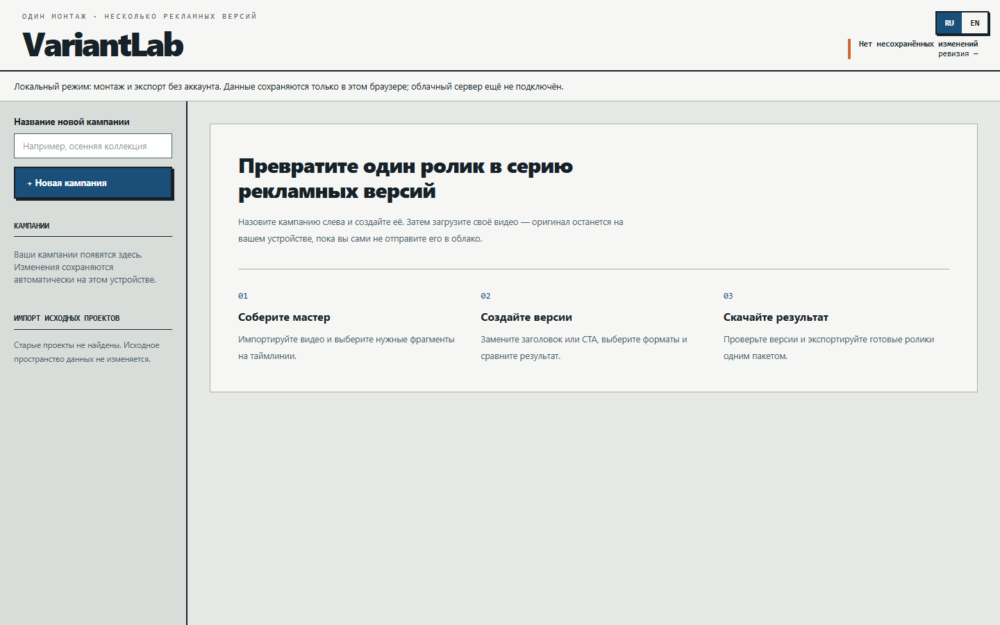
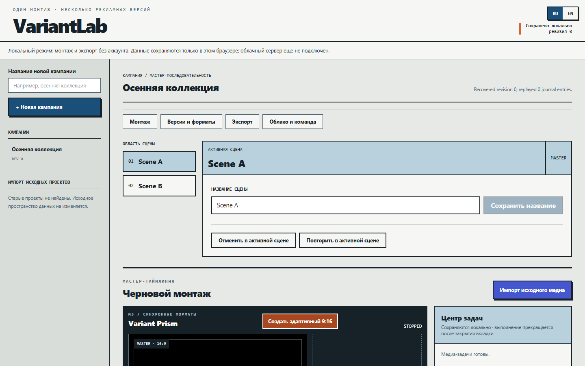

# VariantLab

VariantLab — студия рекламных вариантов: импортируйте видео, соберите мастер, замените текст или медиа, сравните форматы и экспортируйте готовые ролики. Интерфейс RU/EN. **VariantLab остаётся рабочим codename, а не прошедшим проверку товарным знаком.**

Проект начат на базе [OpenCut](https://github.com/OpenCut-app/opencut-classic) (MIT). Исходная лицензия, Copyright 2025–2026 OpenCut и история сохранены. Новая предметная модель и Rust control plane не означают независимого происхождения всего репозитория.

## Статус

[Публичный редактор](https://variantlab-creative-ops-demo.maxeemzhuparov.chatgpt.site) подключён к Sites: вход через ChatGPT, D1 persistence и приватное R2-хранилище. Проверка authenticated public save/upload/reopen ожидает обычного входа в тестовом браузере. **Серверный FFmpeg пока не развёрнут**; экспорт на устройстве работает. Медиа отправляются только явно. [Факты и границы проверки](docs/CONNECTED_SITES.md).

[](https://github.com/godaylor/variantlab/actions/workflows/bun-ci.yml)

Исторические результаты M1–M9 сохранены в [PLAN.md](PLAN.md) и [FINAL_AUDIT.md](FINAL_AUDIT.md); они не заменяют результат текущего commit. Последний main run выявил browser long task в scale-gate. Текущий срез улучшает first-run, расположение таймлинии, навигацию и подготовку облачного пакета; его актуальные проверки фиксируются отдельно.

Основной экран: `/variantlab`; корневой маршрут открывает редактор. Текущий рабочий каталог — `03-variantlab`.

## Возможности



- Именованные кампании, автоматическое локальное сохранение и восстановление.
- Мастер-таймлиния: импорт медиа, монтаж, scoped undo/redo и keyboard-команды.
- Типизированные замены hook/product/headline/CTA/logo с контролем наследования.
- Матрица явно включённых версий и форматов с Preview Wall и диагностикой.
- Локальный пакетный экспорт до 8 видео, переносимый campaign bundle.
- Public Sites: ChatGPT auth, D1 revisions и явная загрузка оригиналов в R2.
- Self-hosted connected: email/password account, PostgreSQL persistence и фоновые задания до 50 видео.
- Продолжение на другом устройстве, конфликтные recovery branches и ссылки проверки фиксированной ревизии.

## Собственная работа и стек

Собственная продуктовая часть находится в `rust/`, `apps/web/src/variantlab/`,
`packages/studio-contract/` и связанном BFF: модель конечной матрицы вариантов,
команды/история, deterministic native/WASM contracts, журнал восстановления,
immutable render manifests, sync/review, worker orchestration и UI рабочих сценариев.
Унаследованный редактор и вспомогательные страницы сохранены с provenance;
мы не выдаём переименование upstream за независимую реализацию.

Фактический стек: Rust, wasm-bindgen/WASM, Next.js 16, React 19, TypeScript,
Tailwind CSS, Sites/Cloudflare Workers + D1/R2, ChatGPT auth, Better Auth, Drizzle, PostgreSQL/SQLx, Redis,
S3-compatible MinIO, WebCodecs, OPFS/IndexedDB, Web Workers, Mediabunny,
VP9/Opus FFmpeg provider, Bun, Docker Compose, Playwright, axe, ESLint и GitHub Actions.
GPUI desktop не входит в поставляемый web-срез.



## Public connected deployment

Текущая бесплатная публикация: [Sites deployment](docs/CONNECTED_SITES.md). Ниже — отдельный self-hosted стек с native render.

[Инструкция](docs/PRODUCTION_DEPLOY.md) описывает один сервер, отдельные production
volumes/network, HTTPS web/media origins и отключённую test identity. Генератор
создаёт уникальные секреты и отказывается перезаписывать существующие. Нужен
доступ к серверу с DNS; публикация browser-local версии не считается connected release.

Проверенный маршрут демонстрации и конкретные ограничения: [docs/DEMO.md](docs/DEMO.md).

## Закреплённые инструменты

- Node.js **22.15.1** (`.node-version`, `.nvmrc`, `engines`).
- Bun **1.2.18**, существующий `bun.lock`; устанавливать зависимости только с `--frozen-lockfile`.
- Rust **1.91.1**, wasm-pack **0.13.1** через repo Docker toolchain.

`node script/bun.mjs` проверяет точные версии и ничего не скачивает. Укажите уже имеющийся Bun через `VARIANTLAB_BUN_BINARY` либо поместите его в игнорируемый `.variantlab-tools/bun.exe` (Windows). Глобальные Node/Bun не переключаются.

```powershell
node script/bun.mjs install --frozen-lockfile
node script/bun.mjs run dev:web:e2e
```

Эта dev-команда использует `http://127.0.0.1:32240/variantlab`. Она не запускает cloud backend. `script/variantlab-web.mjs` читает `VARIANTLAB_ENV_FILE` либо тестовый `variantlab.env.example` и использует ограниченную auth DB role; для connected login нужен уже запущенный VariantLab backend. `VARIANTLAB_WEB_VERIFY_PORT` допускает только 32240–32269 (dev) или 32270–32289 (`production`). Desktop/GPUI не входит в текущий web release cut.

## Изолированный локальный Compose

Проект Compose всегда называется `variantlab-m8`, конфигурация — `docker-compose.variantlab.yml`. Перед запуском проверьте занятость и Windows exclusions портов. Не используйте upstream `docker-compose.yml` для VariantLab.

| Сервис | Локальный адрес |
|---|---|
| Web/BFF | `http://127.0.0.1:32200/variantlab` |
| Rust API health | `http://127.0.0.1:32201/health/ready` |
| PostgreSQL | `127.0.0.1:32210` |
| Redis TCP | `127.0.0.1:32211` |
| MinIO API / console | `127.0.0.1:32212` / `127.0.0.1:32213` |

Внешний диапазон VariantLab — 32200–32299; 32220–32239 зарезервированы для дополнительных сервисов, 32240–32269 для тестов, 32270–32289 для проверки релизной сборки. Внутренние порты не меняются. Overrides: `VARIANTLAB_WEB_PORT`, `VARIANTLAB_API_PORT`, `VARIANTLAB_POSTGRES_PORT`, `VARIANTLAB_REDIS_PORT`, `VARIANTLAB_MINIO_PORT`, `VARIANTLAB_MINIO_CONSOLE_PORT`.

Для текущей локальной проверки используется `variantlab.env.example` с явно тестовыми credentials и `VARIANTLAB_M8_TEST_MODE=1`. Этот профиль включает тестовую identity и не предназначен для публикации. Не меняйте пароли существующего volume простым редактированием env: роли PostgreSQL уже созданы. Для первого отдельного окружения создайте приватный `.env.variantlab`, согласуйте реальные auth/secrets и используйте его через `--env-file`.

```powershell
docker compose --env-file variantlab.env.example -f docker-compose.variantlab.yml -p variantlab-m8 ps
docker compose --env-file variantlab.env.example -f docker-compose.variantlab.yml -p variantlab-m8 build api worker dispatcher web
docker compose --env-file variantlab.env.example -f docker-compose.variantlab.yml -p variantlab-m8 up -d --no-deps postgres redis minio
# После проверенных миграций существующей БД:
docker compose --env-file variantlab.env.example -f docker-compose.variantlab.yml -p variantlab-m8 up -d --no-deps api dispatcher worker web
```

Сохраняйте volumes `variantlab-m8-postgres-data`, `variantlab-m8-redis-data`, `variantlab-m8-minio-data`. Не используйте `down -v`, `docker system prune`, reset или перенос старых VariantLab volumes. Для существующей базы сначала выполните процедуру ниже.

## Проверенная миграция M8

[ADR-0009](docs/adr/0009-campaign-revision-snapshot-compatibility.md) описывает исправление `campaign_revisions`. Применённые 0001/0002 не редактируются. `render_manifest` никогда не используется вместо полного `snapshot`.

```powershell
node script/m8-database-preflight.mjs
# Используйте receipt.json, который вывела именно эта успешная проверка:
node script/m8-apply-verified-migration.mjs .variantlab-backups/<timestamp>/receipt.json
```

Preflight создаёт pg_dump, восстанавливает его в отдельную БД, сравнивает полные строки и проверяет миграции на legacy/fresh fixtures. Apply проверяет checksum backup и всей цепочки SQL из receipt, неизменность источника, SQLx upgrade восстановленной копии и повторный no-op. Только затем он мигрирует локальную VariantLab БД. Backup и проверочные базы сохраняются. Текущая проверенная цепочка — 0001–0006; это не универсальный production migrator.

0004 добавляет таблицы существующего BetterAuth с отдельной ограниченной ролью `variantlab_auth`. Для существующей локальной БД после успешного application receipt:

```powershell
node script/m8-provision-auth-role.mjs .variantlab-backups/<timestamp>/application.json
```

Скрипт не меняет уже установленный пароль роли. Web использует auth role, не superuser. Регистрация/вход доступны в connected панели; локальные медиа не загружаются при входе автоматически.

## Проверки

```powershell
node script/bun.mjs run typecheck:web
node script/bun.mjs run lint:web
node script/bun.mjs test apps/web/src eslint
node script/bun.mjs run build:web
node script/rust-toolchain.mjs fmt
node script/rust-toolchain.mjs clippy
node script/rust-toolchain.mjs test
node script/render-text-parity.mjs
node node_modules/@playwright/test/cli.js test e2e/variantlab-render-bindings.spec.ts --project chromium
node node_modules/@playwright/test/cli.js test --config playwright.m8-compose.config.ts
```

M8 browser gate требует запущенный локальный Compose с тестовым профилем. Он прерывает upload и временно останавливает/возвращает **только** `variantlab-m8-worker`. Проверяйте тяжёлые сборки последовательно в общей Docker-среде. Точные результаты и закрывающий verdict — в [PLAN.md](PLAN.md) и [FINAL_AUDIT.md](FINAL_AUDIT.md).

## Архитектура и лицензии

`rust/` владеет domain contracts и правилами; `apps/web/` — UI/platform shell; Next BFF переводит session в подписанную tenant identity; PostgreSQL хранит durable state, Redis передаёт задания, MinIO хранит originals/artifacts.

[Архитектура](docs/ARCHITECTURE.md), [спецификация](docs/TRANSFORMATION_SPEC.md), [ADR M8](docs/adr/0008-m8-connected-cloud-batch.md), [ADR M9](docs/adr/0013-connected-continuity-review.md), [MIT LICENSE](LICENSE), [THIRD_PARTY_NOTICES](THIRD_PARTY_NOTICES.md).

FFmpeg ограничен закреплённой сборкой VP9/Opus WebM без GPL/non-free/H.264/AAC. Перед распространением образов необходимы полные SBOM, лицензии и build/source receipts. Публичные пакеты используют namespace `@variantlab/*` и `variantlab-wasm`.

