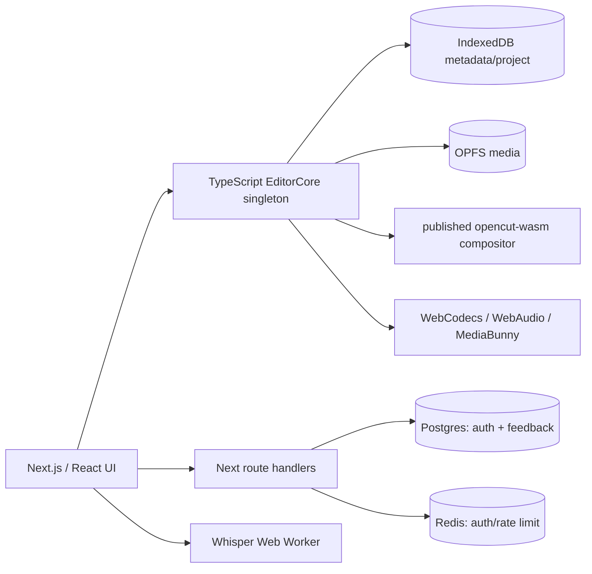
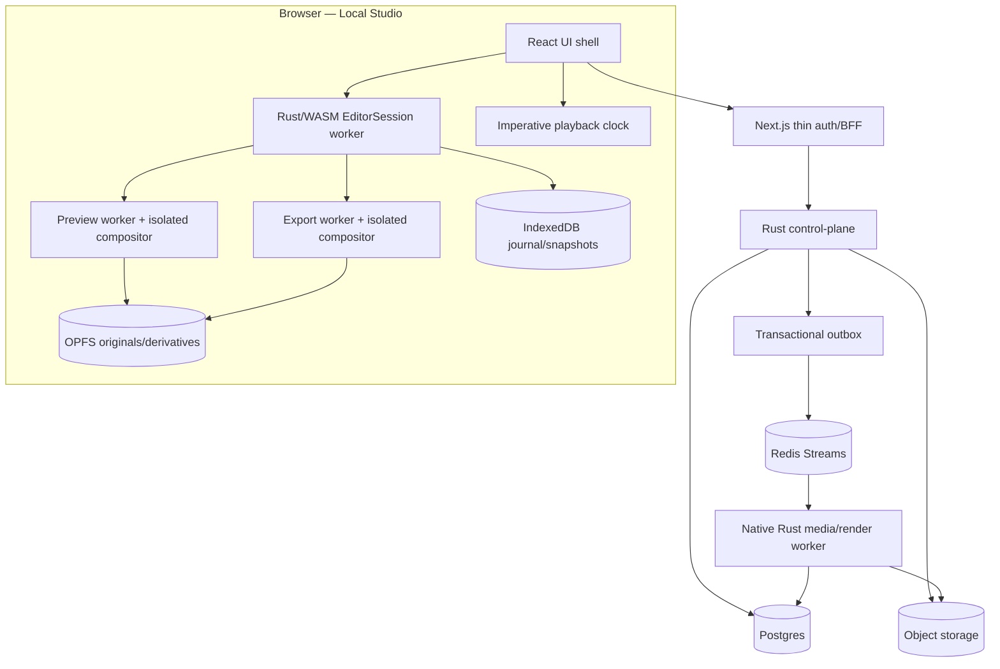
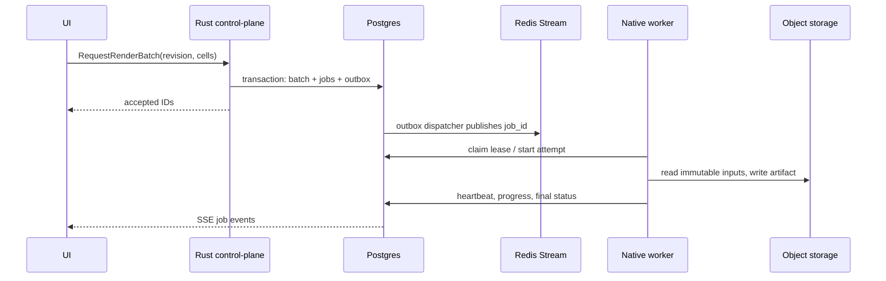

# VariantLab — целевая архитектура

> Статус: architecture proposal, implementation не начата  
> Дата: 2026-08-27  
> Связанные документы: [BASELINE_AUDIT.md](./BASELINE_AUDIT.md), [TRANSFORMATION_SPEC.md](./TRANSFORMATION_SPEC.md), [../PLAN.md](../PLAN.md)

## 1. Architecture decision

VariantLab строится как local-first media application с одним доменным ядром в Rust и двумя режимами исполнения:

1. **Local Studio:** React UI, Rust/WASM session, IndexedDB/OPFS, browser workers и локальный export.
2. **Connected Studio:** тот же versioned domain/render contract, Rust control plane, Postgres, object storage и durable media workers.

Connected mode расширяет local workflow cloud continuity, review и render jobs. Он не становится обязательным условием для открытия и редактирования локального campaign.

Главные решения:

- platform-agnostic логика живёт только в `rust/`;
- TypeScript в `apps/web` — UI и platform adapter, не второе доменное ядро;
- variant model — фиксированная четырёхслойная иерархия, не arbitrary DAG/rules engine;
- commands, snapshots, render manifests и jobs versioned и deterministic;
- preview и export получают immutable plan, но работают в разных executors и caches;
- Postgres — source of truth connected-состояния; Redis — transport/cache, но не canonical storage;
- миграция идёт вертикальными пользовательскими сценариями, без отдельного big-bang rewrite в Rust.

## 2. От текущей системы к целевой

### Текущая фактическая схема



В `apps/web/src/core/index.ts` singleton объединяет commands, timeline, playback, scenes, project, media, renderer, save, audio, selection и clipboard. Timeline-команды, placement/ripple/snapping, storage migrations и большая часть media orchestration реализованы в TypeScript. Rust уже даёт time/GPU/effects/masks/compositor, но пока не является единым domain source of truth. Полная доказательная карта находится в baseline-аудите.

### Целевая схема



## 3. Границы ответственности

| Слой | Владеет | Не владеет |
|---|---|---|
| Rust domain | campaign/timeline/variant semantics, commands, validation, history, render/job plans | DOM, React, browser APIs, visual panel state |
| React UI | rendering, focus, hover, panel layout, dialogs, drag ghost, accessible interaction | canonical project state, timeline math, inheritance rules |
| Browser platform | File System/OPFS/IndexedDB adapters, WebCodecs, WebAudio, worker lifecycle | product validation и duplicate domain models |
| Next.js BFF | session translation, CSRF boundary, request streaming, same-origin transport | project authorization rules и media business logic |
| Rust control plane | authorization, revisions, sync, jobs, repositories | codec implementation и UI state |
| Native worker | probe/proxy/waveform/transcription/render capabilities | canonical job status и tenant policy |
| Postgres | durable connected truth, leases, attempts, audit | binary media и transient progress fan-out |
| Object storage | immutable originals/derivatives/artifacts | project metadata и authorization decisions |
| Redis | dispatch, progress fan-out, short-lived cache/rate limits | canonical jobs/projects/revisions |

Selection/focus остаются ephemeral UI state, но любая команда над выбранными IDs валидируется Rust engine. Media clocks исполняются platform-specific кодом, а time math, frame conversion и edit semantics остаются в Rust.

## 4. Ограниченная variant model

```text
Campaign
└── MasterSequence — ровно один
    ├── Scene[] — упорядоченные канонические монтажные сегменты
    ├── CreativeSet rows — master/default + до 11 альтернатив
    └── DeliveryProfile columns — до 24 явно созданных format+locale profiles
        └── Enabled VariantCell — максимум 100 на campaign
```

Порядок разрешения неизменяем:

```text
MasterSequence
  → CreativeSet slot replacements
  → DeliveryProfile format/locale rules
  → VariantCell layout exception
  → ResolvedVariant + Diagnostics + RenderFingerprint
```

### Инварианты v1

- Один campaign содержит ровно один master timeline.
- MasterSequence содержит одну или несколько ordered Scene; Scene не является variant parent. Inclusion/order — canonical MasterSequence state, одинаковый для всех cells revision; profile/cell не могут менять sequence duration. RenderManifest фиксирует это состояние, а active scene UI не влияет на export.
- Максимум 12 `CreativeSet`, включая default/master row.
- Максимум 6 format profiles и 12 locale profiles; пользователь явно объединяет их максимум в 24 `DeliveryProfile`.
- Максимум 100 активных `VariantCell`; уникальный ключ — `(creative_set_id, delivery_profile_id)`.
- Полный Cartesian product никогда автоматически не создаётся. До enable UI показывает число cells, прогноз работы и storage/render cost.
- `CreativeSet` меняет только значения типизированных slots: hook media, product shot, headline, CTA, logo.
- Replacement не меняет границы времени и обязан соблюдать slot type/fit policy.
- `DeliveryProfile` меняет canvas, safe areas, locale, caption preset, font fallback и layout constraints, но не timing, fps и audio mix.
- Cell exception разрешает только crop/transform/text-fit именованного slot. Максимум 20 cells с exceptions; они явно маркируются как detached.
- Нельзя удалить master slot с живыми references. Пользователь сначала выбирает remap или осознанный drop; silent orphaning запрещён.
- Batch render ограничен 8 cells в первой local версии и 50 cells в connected beta.
- Нет nested variants, multiple parents, cycles, custom axes и исполняемых expressions.

Limits являются versioned domain policy в Rust, а не условными `if` в UI.

## 5. Целевая структура `rust/`

Названия ниже задают bounded contexts. Физическое разделение на crates принимается ADR и не должно приводить к мелкой бессмысленной фрагментации.

```text
rust/
  crates/
    studio-model/          Campaign, BrandKit, Sequence, Slot, Variant types
    edit-engine/           commands, validation, transactions, undo/redo
    timeline-engine/       trim, split, move, ripple, snapping, interval index
    variant-engine/        inheritance, limits, resolution, invalidation
    media-plan/            probe results, derivatives, proxy/waveform specs
    transcript-engine/     word timing, caption segmentation, locale mapping
    validation-engine/     safe areas, overflow, missing glyphs, readiness
    render-plan/           deterministic RenderManifest and dirty ranges
    sync-protocol/         command/snapshot/sync envelopes
    job-contracts/         job state machine, keys, progress and errors
    codec-policy/          provider-neutral capability and codec profiles
    time/                  existing integer media-time primitives
    effects/               existing effects core
    masks/                 existing masks core
    gpu/                   existing GPU abstraction
    compositor/            existing compositor, driven by RenderPlan
  wasm/
    EditorSession facade   bridge only; no independent business rules
  services/
    control-plane/         Axum API, authorization, SQLx repositories
    worker/                probe/proxy/waveform/transcription/render executors
```

`apps/web` постепенно становится shell:

```text
apps/web/src/
  editor-ui/               React views and interaction adapters
  platform/
    local-store/           IndexedDB/OPFS adapters
    browser-media/         WebCodecs/WebAudio/file handles
    workers/               WASM/preview/export/transcription bootstrap
    auth/                  session adapter
    cloud-client/          generated HTTP/SSE client
```

Rust types экспортируются в TypeScript из versioned schema, например через `ts-rs` или эквивалент, выбранный ADR. Web должен использовать локально собранный workspace WASM, а не независимо обновляемый npm `opencut-wasm`.

## 6. Command, event и history engine

### Контракты

```rust
CommandEnvelope {
    schema_version,
    command_id,
    campaign_id,
    master_sequence_id,
    scene_scope: SceneScope,
    variant_scope: VariantScope,
    actor_id,
    device_id,
    base_revision,
    transaction_id,
    history_scope,
    payload,
}

Commit {
    revision,
    events,
    inverse_transaction,
    change_set,
    snapshot_hash,
}

ChangeSet {
    changed_entities,
    entity_versions,
    dirty_time_ranges,
    affected_variant_cells,
    invalidated_render_keys,
    warnings,
}
```

`SceneScope` всегда присутствует и имеет тип `Sequence | Scene(id)`. `VariantScope` всегда присутствует и имеет тип `Master | CreativeSet(id) | DeliveryProfile(id) | VariantCell(id)`. Команда не передаёт «неявный active target» и не опускает scope: она выбирает явный enum case даже для всей sequence или master.

IDs и wall-clock timestamps создаются снаружи и передаются в command. В engine запрещены `Date.now()`, случайные IDs и несортированный обход unordered collections. Одинаковые snapshot + command sequence обязаны давать одинаковый snapshot hash в native и WASM.

### Interaction transaction

```text
pointer-down
  → begin_preview(scope)
  → preview command не чаще одного раза на RAF
  → pointer-up: prepare one transaction
  → durable journal receipt
  → finalize + publish ChangeSet

Escape / pointer cancel
  → cancel preview
  → canonical state и history не меняются
```

### History scopes

- `Campaign`
- `MasterSequence`
- `MasterScene(id)`
- `CreativeSet(id)`
- `DeliveryProfile(id)`
- `VariantCell(id)`

Undo не записывает старый snapshot в «текущую активную сцену». Он создаёт compensating transaction для зафиксированного scope и остаётся воспроизводимым/аудируемым. UI до выполнения показывает конкретную операцию: `Undo “Trim clip” — Master`.

Selection, focus, playback, scroll и открытые panels не входят в domain history. No-op command не создаёт event, autosave и undo entry. History ограничена memory budget, а durable journal compacts в checkpoint.

## 7. Local-first persistence и recovery

### Commit protocol

1. `EditorSession.prepare_command()` валидирует command и возвращает prepared commit.
2. Web adapter атомарно пишет transaction в IndexedDB journal.
3. После durable receipt session выполняет `finalize_commit()` и публикует `ChangeSet`.
4. Background compaction создаёт checksum snapshot каждые 50 transactions или 2 MB journal.
5. Recovery загружает последний checksum-valid snapshot и replay только валидной части journal.

Статус `Saved locally` означает нулевую потерю уже подтверждённой interaction при crash. Ошибка записи сохраняет dirty state, показывает retry и не отключает `beforeunload`/`pagehide` защиту.

### Media import protocol

```text
OPFS staging stream
  → streaming SHA-256
  → content/MIME probe + resource limits
  → derivative plan
  → atomic asset manifest commit
  → immutable original becomes addressable
```

Originals content-addressed и immutable. Proxy, waveform, thumbnail, transcript и export — пересоздаваемые derivatives с ключом:

```text
sha256(input hashes + normalized spec + engine version)
```

Broken import никогда не появляется как успешный asset. Quota failure сохраняет объяснимый recovery action.

### Legacy data

Старая база OpenCut не изменяется на месте. Importer читает её в новый VariantLab namespace, валидирует snapshot/hash и только после успешного открытия предлагает удалить legacy copy. Dual-write запрещён: он создаёт две расходящиеся истины.

### Editable campaign bundle

Editable bundle и render package — разные contracts. Campaign bundle содержит versioned checksum snapshot, BrandKit/profile/cell state, content-addressed asset manifest, pinned font/model references и provenance. Media может включаться явно или оставаться relinkable по hash. Export/import выполняется streaming, без полного archive в памяти.

Importer сначала читает manifest в staging, проверяет schema/version, normalized paths, entry count, compressed/uncompressed limits, hashes и provenance, затем атомарно создаёт новый campaign ID. Он отклоняет traversal, archive bombs, дубликаты canonical paths и partial/corrupt assets. Bundle не содержит session secrets, signed URLs, transient cache или cloud authorization.

## 8. React state и high-frequency interaction

Состояние разделено на четыре независимых канала:

1. **Rust/WASM domain:** campaign, timeline, revisions, slots, variants, diagnostics.
2. **Zustand UI:** panels, viewport, focus, ephemeral selection, drag ghost, preferences.
3. **Imperative playback:** playhead/frame scheduler вне React render cycle.
4. **Async jobs:** local/cloud status через typed subscription.

`EditorSession` публикует entity revisions. `useSyncExternalStore` подписывает component на конкретный track, clip, cell или job, а не на уведомления всех managers.

### Timeline

- горизонтальный interval index вычисляется в Rust;
- вертикальная virtualization поддерживает variable-height tracks;
- DOM содержит только видимые tracks/clips с небольшим overscan;
- playhead двигается imperative transform;
- coalesced pointer updates — не чаще одного на RAF;
- pointer capture + preview transaction заменяют HTML5 DnD для timeline geometry;
- pointer, keyboard и command palette вызывают одни и те же Rust commands;
- accessibility outline/treegrid даёт линейный путь к пространственной модели timeline.

### Variant Matrix

- semantic virtualized grid: rows — `CreativeSet`, columns — `DeliveryProfile`;
- roving tabindex, row/column labels, bulk selection и compare mode;
- базовая matrix projection публикует `ready/stale/warning/rendering/error/detached` и provenance; connected review в M9 отдельно добавляет revision-bound `approved/rejected/stale-approval`;
- synchronized preview использует общий transport, но декодирует только видимые cells;
- thumbnails — cancellable low-priority jobs;
- матрица запрашивает projection pages, а не весь resolved graph.

### Responsive boundary

Полный editor поддерживается от 1024 px, оптимальный studio mode — от 1280 px. Ниже доступен полноценный review/approval/job mode. Система не обещает профессиональный touch timeline там, где он не может быть качественным.

## 9. Variant resolution и invalidation

Resolver принимает immutable `MasterRevision`, `CreativeSet`, `DeliveryProfile` и optional `CellException`.

```text
validate IDs/types/limits
  → apply typed slot replacements
  → apply profile layout/locale rules
  → apply allowlisted cell exception
  → validate resolved graph
  → emit diagnostics + dirty ranges
  → compute canonical fingerprint
```

Dependency index связывает master entities/slots с affected cells. Изменение одного headline не разрешает заново все render trees, а инвалидирует только связанные text/layout nodes. `ChangeSet` переносит список affected cells через WASM boundary.

Cache key включает master revision, option/profile versions, patch hash, engine version, pinned font hashes и relevant media hashes. Cache bounded LRU; memory pressure может удалить любой derived result без потери данных.

`BrandKit` versioned и входит в campaign/render fingerprint. Validation engine выдаёт для каждого результата `rule_id`, source kit revision и affected entity/cell. V1 rules ограничены logo requirement, allowed color/font tokens, minimum text size, custom safe regions и master-sequence duration; они не заявляют юридическую или platform compliance сверх явно заданного правила.

## 10. Media pipeline

```text
immutable original
  ├─→ probe + capability record
  ├─→ seekable proxy tiers
  ├─→ thumbnail / keyframe index
  ├─→ multiresolution waveform pyramid
  ├─→ normalized mono transcription chunks
  └─→ transcript/caption artifact
```

- Waveform хранит min/max/RMS pyramid и читает только уровень текущего zoom.
- Proxy/transcription schedulers уступают CPU/GPU playback и interaction.
- Большие buffers передаются workers как transferable или streams, не копируются без необходимости.
- Decode/cache pools имеют byte budgets, LRU и cancellation устаревших requests.
- Audio/video clock drift измеряется и периодически reconcile, а не скрывается late-buffer эвристикой.
- Transcription runtime может быть browser или cloud adapter; caption segmentation, time mapping и locale rules находятся в Rust.
- Automatic translation не является v1 promise; locale copy вводится или импортируется человеком.

## 11. Preview и render isolation

Rust создаёт immutable manifest:

```rust
RenderManifest {
    schema_version,
    engine_version,
    campaign_revision,
    master_sequence_id,
    scenes: Vec<RenderSceneBoundary>,
    sequence_duration_ticks,
    variant_fingerprint,
    canvas,
    fps,
    duration,
    color_space,
    asset_hashes,
    font_hashes,
    resolved_nodes,
    audio_graph,
    codec_profile,
}

RenderSceneBoundary {
    scene_id,
    scene_revision,
    included,
    start_tick,
    duration_ticks,
}
```

`scenes` записываются в canonical MasterSequence order и включают excluded entries для provenance. `start_tick` для included scenes задаёт позицию в итоговой sequence; active scene UI в manifest отсутствует.

Исполнители:

- `preview.worker`: отдельный WASM compositor, WebCodecs и OffscreenCanvas;
- `utility.renderer`: отдельный owned instance/surface/cache для snapshot и thumbnail, никогда не делящий mutable compositor с preview/export;
- `export.worker`: отдельный WASM instance, surface и cache;
- native/cloud worker: тот же Rust `RenderPlan`, native compositor и codec provider.

Preview не экспортируется через DOM capture. Export не читает mutable live editor state. Batch фиксируется на campaign revision; последующие edits помечают готовый artifact как stale, но не меняют уже запущенную job.

V1 render contract: SDR sRGB, 8-bit, pinned fonts и один master fps. HDR, arbitrary color transforms и per-variant fps отложены.

Browser export обязан использовать streaming sink или chunked artifact store; `ArrayBuffer` всего результата не допускается для больших jobs.

## 12. Local и cloud jobs

Единый `JobSpec` и state machine используются обоими executors. UI не знает, выполняется ли capability локально или удалённо; он знает provider, ограничения и durability semantics.

### Local jobs

- metadata, proxy, thumbnail, waveform, transcription и local export;
- persistent state в IndexedDB, artifacts в OPFS;
- после закрытия tab job не «продолжает работать», но безопасно возобновляется;
- concurrency адаптируется к playback и memory pressure;
- local batch v1 ограничен восемью cells.

### Cloud data model

Минимальные таблицы:

- `tenants`, `memberships`;
- `campaigns`, `campaign_events`, `campaign_snapshots`;
- `media_assets`, `media_derivatives`, `upload_sessions`;
- `render_batches`, `jobs`, `job_attempts`;
- `outbox_events`, `export_artifacts`;
- `review_links`, `approvals`.

Каждая tenant-owned row содержит `tenant_id`; authorization выполняется в Rust и дублируется Postgres RLS как defense in depth. Существующие auth/feedback таблицы мигрируются отдельно и не смешиваются с media blobs.

### Durable job flow



Доставка at-least-once, поэтому job идемпотентен. Уникальный `job_key` строится из job type, input hashes, normalized spec и engine version. Watchdog возвращает expired leases. Redis message содержит ID, а не единственную копию state.

### API boundary

Пример минимального connected API:

- `POST /v1/campaigns/:id/commands` с `If-Match`/base revision;
- `POST /v1/assets/uploads` и multipart signed parts;
- `POST /v1/uploads/:id/complete`;
- `POST /v1/render-batches`;
- `GET /v1/jobs/:id/events` через SSE;
- `POST /v1/review-links`;
- `POST /v1/reviews/:token/approvals`.

Next.js route handlers остаются thin same-origin adapters. Canonical project authorization и command validation выполняет Rust control plane.

## 13. Sync без преждевременного CRDT

Realtime multi-user editing не входит в v1.

- Один active writer lease на campaign.
- Offline commands всегда сначала durable локально.
- Reconnect отправляет versioned commands с `base_revision`.
- Если server head совпадает, commands применяются последовательно.
- При настоящем multi-device conflict сервер не делает скрытый merge: создаётся `Recovered branch`, обе версии сохраняются, пользователь выбирает продолжение.
- Review/approval привязаны к конкретной immutable revision и становятся stale после нового commit.

Это менее демонстративно, чем CRDT, но безопаснее для timeline и позволяет позже спроектировать collaboration на реальных usage data.

## 14. Performance contracts

Reference stress project: двухчасовой source, 20 tracks, 10,000 clips/keyframes суммарно, 100 active cells; reference browser/device фиксируются отдельным benchmark manifest.

| Метрика | Target |
|---|---:|
| Rust command apply p95 | <8 ms |
| drag preview calculation p95 | <4 ms |
| pointer-to-paint p95 | <16.7 ms |
| React commit во время continuous gesture p95 | <8 ms |
| timeline pan/zoom | ≥55 FPS |
| видимые timeline DOM nodes | ≤300 |
| видимые matrix cells | ≤80 |
| warm seek, 1080p proxy p95 | <120 ms |
| cold seek, 1080p proxy p95 | <400 ms |
| dropped frames, 60 s 1080p30 | <1% |
| local durable journal receipt p95 | <100 ms |
| typical `ChangeSet` через WASM | <32 KB |
| editor memory без transcription model | <800 MB |
| resolve одной cell p95 | <10 ms |
| invalidation 100 cells | <100 ms |
| warm open: 5,000 elements / 48 cells | <2 s до интерактивности |
| cloud job dispatch p95 | <2 s |

Budgets проверяются в CI/benchmark run и в браузерном performance trace. Если reference media/hardware ещё не закреплены, цифры не считаются выполненными.

## 15. Reliability и observability

### Failure semantics

- Canonical `JobState`: `queued/preparing/running/pausing/paused/cancelling/succeeded/failed/cancelled`; retry создаёт новый attempt и возвращает job в `queued`.
- UI wrapper для ещё не созданной asynchronous task может дополнительно иметь `idle`, но не меняет canonical persisted `JobState`.
- Preview rejection освобождает render lock в `finally`, показывает recoverable error и может пересоздать worker.
- Save не считается успешным до durable receipt.
- Worker crash оставляет retryable attempt, не зависшую canonical job.
- Out-of-space, unsupported codec, missing asset, expired signed URL и version mismatch имеют отдельные user actions.
- Static health endpoint не считается readiness check; deployment проверяет DB, Redis/outbox lag и object storage отдельно.

### Observability

OpenTelemetry trace связывает `command_id → sync → render_batch → job_attempt`. Основные метрики:

- `command_apply_ms`, `interaction_frame_ms`, `preview_seek_ms`, `dropped_frames`;
- `journal_flush_ms`, `recovery_replay_ms`, `variant_resolve_ms`;
- `cache_bytes`, `cache_evictions`, `worker_queue_depth`;
- `render_rtf`, `job_wait_ms`, `job_attempts`, `sync_lag`.

Telemetry opt-in для client diagnostics и не включает raw media, transcript/copy text, signed URLs или исходные filenames.

## 16. Security boundaries

- Session cookies: HttpOnly, Secure, SameSite; browser mutations защищены от CSRF.
- Object keys не содержат user filenames; signed URLs короткоживущие и scoped.
- MIME определяется по содержимому; проверяются byte size, duration, pixel count и decode resource limits.
- SVG и media считаются untrusted; SVG rasterized/sandboxed.
- Native codec workers используют deny-by-default egress с allowlist только к необходимым Redis/Postgres/object-storage/telemetry endpoints; произвольный internet egress запрещён. Immutable inputs монтируются read-only, а временная запись разрешена только в отдельный bounded scratch/output staging. CPU/RAM/time/process limits обязательны.
- User text/subtitles не интерпретируются как HTML; naming templates декларативны.
- Tenant ID присутствует во всех connected paths; negative isolation tests обязательны.
- CSP, HSTS, frame-ancestors, Permissions-Policy и аккуратная forwarded-IP trust policy являются deployment gates.
- Secrets и commercial API keys никогда не передаются в browser bundle.

## 17. Codec, license и provenance boundary

- Browser и native use cases используют общий `CodecProvider` contract и capability negotiation.
- Проверки `VideoEncoder` и codec strings не разбрасываются по UI.
- FFmpeg, если выбран, поставляется отдельным pinned runtime image с опубликованной build configuration.
- GPL/non-free build не попадает в default distribution без отдельного legal/product решения.
- H.264/AAC patent/licensing оцениваются для выбранных рынков и способа дистрибуции.
- Каждый font, model, music/template и remote asset хранит license/provenance record.
- CI генерирует SBOM и third-party notices.
- Корневой MIT `LICENSE`, уведомление OpenCut и история происхождения сохраняются; продукт имеет About/Open Source экран.
- Имя/логотип OpenCut не используются как бренд VariantLab и не создают впечатление endorsement.

## 18. Test architecture

### Rust

- unit tests для каждой команды/validation rule;
- property tests: split/trim/ripple/snapping, apply+inverse identity, no cycles/limits;
- randomized command sequences и replay determinism;
- serialization/version fixtures и corrupt data recovery;
- native/WASM snapshot-hash conformance;
- render-plan golden fixtures.

### Web

- component tests для focus, keyboard model, live regions и typed error states;
- selector render-count tests, virtualization и cancellation;
- DnD/pointer and keyboard parity tests против одинаковых commands;
- no nested interactive controls, automated axe и manual screen-reader checklist.

### Media

- exact frame count/duration/audio alignment;
- native/WASM golden frames с согласованным perceptual threshold;
- codec capability matrix, unsupported input и corrupted media;
- cancellation, memory/quota pressure и worker termination;
- immutable manifest/fingerprint tests.

### Browser/E2E

- Chromium golden path с реальными small media fixtures;
- Firefox/WebKit smoke с capability-driven expectations;
- offline, hard reload/context kill, cross-tab conflict и reconnect;
- 10k timeline/100-cell matrix performance trace;
- local batch resume и cloud worker crash/retry;
- 200% zoom, reduced motion и keyboard-only workflow.

CI не использует `continue-on-error` для required gates и не заменяет tests командой `echo`.

## 19. Migration strategy

Нельзя сначала «переписать всё в Rust», а затем начать продукт. Каждый milestone в [PLAN.md](../PLAN.md) поставляет пользовательский сценарий и переносит только необходимый ему bounded slice.

Правило вертикального переноса:

1. зафиксировать current behavior contract и regression fixture;
2. реализовать Rust command/model/plan;
3. проверить native/WASM parity;
4. подключить React через generated contract;
5. удалить дублирующее TypeScript business rule в том же slice;
6. выполнить browser/E2E и performance gate;
7. оставить rollback/import path для пользовательских данных.

Feature flag допустим для rollout, но постоянный dual implementation запрещён.

## 20. One-way-door ADRs

До implementation фиксируются ADR:

1. Rust — единственный canonical domain; TypeScript — UI/platform adapter.
2. Новый storage format импортирует OpenCut, но не dual-writes legacy schema.
3. Time — integer ticks + rational fps.
4. Variant graph — только заданная hierarchy и limits.
5. Originals immutable/content-addressed; derivatives пересоздаваемы.
6. Commands/events versioned/deterministic; undo — compensating transaction.
7. Preview/export используют общий manifest и isolated executors.
8. Postgres — source of truth, Redis — dispatch/cache.
9. V1 conflict model — explicit recovered branch, без CRDT.
10. Templates декларативны; пользовательский JavaScript не исполняется.
11. V1 rendering — SDR sRGB, pinned fonts, один master fps.
12. Codec provider/FFmpeg distribution изолированы legal boundary.

Эта архитектура считается принятой только после того, как соответствующие ADR, data fixtures и benchmark corpus появятся рядом с первым vertical slice. До этого документ задаёт проверяемое направление, а не выдаёт ещё не реализованные свойства за существующие.
